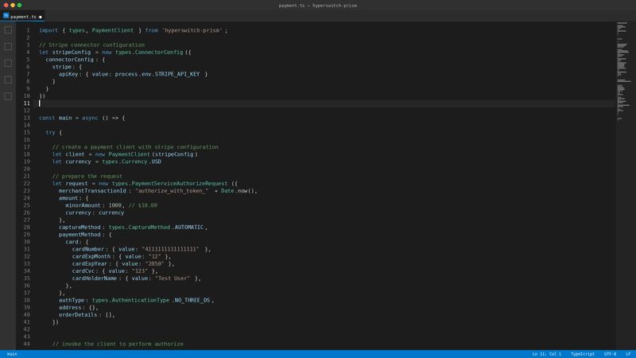

<div align="center">


# Hyperswitch Prism

**One integration. Any payment processor.**
**Switch processors with few lines of code.**

<p align="center">
  
  <br/>
</p>

[](https://opensource.org/licenses/Apache-2.0)


[Website](https://hyperswitch.io/prism) · [Documentation](https://docs.hyperswitch.io/integrations/prism/prism) · [Slack Community](https://join.slack.com/t/hyperswitch-io/shared_invite/zt-362xmn7hg-ujdw8Wvx_~BgNTLrCcdCPw)

</div>


## What is Prism?

Prism is a stateless, unified connector library to connect with any payment processor. It is extracted out of the hardened integrations through continuous testing & iterative bug fixing over years of usage within [Juspay Hyperswitch](https://github.com/juspay/hyperswitch).


### Why are payment processor integrations such a big deal?

Every payment processor has diverse APIs, error codes, authentication methods, pdf documents to read, and behavioural differences between the actual environment and documented specs. 

A small mistake or oversight can create a huge financial impact for businesses accepting payments. Thousands of enterprises around the world have gone through this learning curve and iterated and fixed payment systems over many years.

All such fixes/improvements/iterations are locked-in as tribal knowledge into Enterprise Payment Platforms and SaaS Payment Orchestration solutions. 

Hence, **Prism** - to open up payment diversity to the entire world as a simple, lightweight, zero lock-in, developer friendly payments library.

**Prism is built and maintained by the team behind [Juspay Hyperswitch](https://github.com/juspay/hyperswitch) - the open-source payments platform with 40K+ Github stars and used by leading enterprise merchants around the world.**

**Note:** In all honesty, payments are not more complicated than database drivers. It is simply just that the industry has not arrived at a standard (and it never will!!).


## What does Prism do well?
- **One request schema** for every payment. The same authorize call works against Stripe, Adyen and many more without additional lines of code.
- **Stateless. No database, no stored PII.** Credentials are not stored/ logged by the library. It lives only up to the lifetime of your HTTP client.
- **PCI scope reduction.** The card data flowing/ not flowing into the library is your choice. You can choose to leverage any payment processor vault or your own PCI certified vault. Nothing is logged or stored by the library.


## Integrations - Status

Prism supports **multiple connectors** with varying levels of payment method and flow coverage. Each connector is continuously tested against real sandbox/ production environments.

**Legend:** ✓ Supported | x Not Supported | ⚠ In Progress | ? Needs Validation

| Status | Description |
|--------|-------------|
| ✓ | Fully implemented and tested |
| x | Not applicable or unsupported by processor |
| ⚠ | Implementation in progress or partial |
| ? | Implementation needs validation against live environment |

[View Complete Connector Coverage →](./docs-generated/all_connector.md) to understnad which payment methods (Cards, Wallets, BNPL, Bank Transfers, etc.) and flows (Authorize, Capture, Refund, etc.) are supported for each processor. We will be enhancing the converage on a ongoing basis.

## What Prism does not do (yet)?
- **Built-in vault or tokenization service.** This is a design choice. You may bring your own vault, or use the payment processor's vault.
- **Retry or routing logic.** It lives in [Juspay Hyperswitch](https://github.com/juspay/hyperswitch). Prism is only the transformation layer.
- **Beyond payments.** The diversity exists beyond payments - in subscriptions, fraud, tax, payouts. And it is our aspiration, to evolve Prism into a stateless commerce library.

## Architecture
A very high level overview of the Prism architecture and components. To understand more [refer docs](https://docs.hyperswitch.io/integrations/prism/architecture)

```
┌─────────────────────────────────────────────────────────────────┐
│                        Your Application                         │
└───────────────────────────────┬─────────────────────────────────┘
                                │
                                ▼
┌─────────────────────────────────────────────────────────────────┐
│                         Prism Library                           │
│     (Type-safe, idiomatic interface, Multi-language SDK)        │
└────────────────────────────────┬────────────────────────────────┘
                                 │
                                 ▼
         ┌───────────────────────┼───────────────────────┬───────────────────────┐
         ▼                       ▼                       ▼                       ▼
   ┌──────────┐           ┌──────────┐           ┌──────────┐           ┌──────────┐
   │  Stripe  │           │  Adyen   │           │ Braintree│           │ + more │
   └──────────┘           └──────────┘           └──────────┘           └──────────┘
```

---

## 🚀 Quick Start

**Before integrating**, read the SDK guide for your language — it covers connector authentication configs, required fields per connector, sandbox test cards, status codes, and common runtime pitfalls.
>
> | Language | SDK Integration Guide |
> |----------|-----------------------|
> | **Python** | [sdk/python/README.md](./sdk/python/README.md) |
> | **Node.js** | [sdk/javascript/README.md](./sdk/javascript/README.md) |
> | **Rust** | [sdk/rust](./sdk/rust) |
>
**Demo Application**: Checkout the [E-Commerce Demo](./demo/e-commerce) for a complete working example with Stripe and Adyen integration.

### Install the Prism Library

Start by installing the library in the language of your choice.
<!-- tabs:start -->

#### **Node.js**

```bash
npm install hyperswitch-prism
```

#### **Python**

```bash
pip install hyperswitch-prism
```

#### **Java/Kotlin**

Add to your `pom.xml`:

```xml
<dependency>
    <groupId>io.hyperswitch</groupId>
    <artifactId>prism</artifactId>
    <version>0.0.4</version>
</dependency>
```

For detailed installation instructions, see [Installation Guide](./getting-started/installation.md).

---

### Make a Payment

<!-- tabs:start -->

#### **Node.js**

```typescript
import { PaymentClient, types, IntegrationError, ConnectorError } from 'hyperswitch-prism';

let config: types.ConnectorConfig = {
    connectorConfig: {
        stripe: {
            apiKey: { value: "sk_test_" }
        }
    }
}

const main = async () => {
    try {
        let client = new PaymentClient(config)
        let request: types.PaymentServiceAuthorizeRequest = {
            merchantTransactionId: "authorize_123",
            amount: {
                minorAmount: 1000, // $10.00
                currency: types.Currency.USD,
            },
            captureMethod: types.CaptureMethod.AUTOMATIC,
            paymentMethod: {
                card: {
                    cardNumber: { value: "4111111111111111" },
                    cardExpMonth: { value: "12" },
                    cardExpYear: { value: "2050" },
                    cardCvc: { value: "123" },
                    cardHolderName: { value: "Test User" },
                },
            },
            authType: types.AuthenticationType.NO_THREE_DS,
            address: {},
            orderDetails: [],
        }
        let response: types.PaymentServiceAuthorizeResponse = await client.authorize(request);
        switch (response.status) {
            case types.PaymentStatus.CHARGED:
                console.log("success");
                break;
            default:
                console.error("failed");
        }
    } catch (e: any) {
        if (e instanceof IntegrationError) {
            console.error("Error", e);
        } else if (e instanceof ConnectorError) {
            console.error("Error", e);
        } else {
            console.error("Error", e);
        }
    }
}

main()
```


## 🤖 Building with AI Assistants

If you are building with AI assistants, point at the `curl` to fetch the complete SDK reference:

> ```bash
> curl -fsSL https://raw.githubusercontent.com/juspay/hyperswitch-prism/main/llm/llm.txt
> ```

This file contains complete SDK documentation including installation, payment operations, error handling, connector configuration, field probe data, and examples for all payment processors.

## 🔄 Routing between Payment Providers

Once the basic plumbing is implemented you can leverage Prism's core benefit - **switch payment providers by changing one line**.

```typescript
  // Routing rule: EUR -> Adyen, USD -> Stripe
  const currency = types.Currency.USD;

  let stripeConfig: types.ConnectorConfig = {
      connectorConfig: {
          stripe: {
              apiKey: { value: process.env.STRIPE_API_KEY! }
          }
      }
  }

  let adyenConfig: types.ConnectorConfig = {
      connectorConfig: {
          adyen: {
              apiKey: { value: process.env.ADYEN_API_KEY! },
              merchantAccount: { value: process.env.ADYEN_MERCHANT_ACCOUNT! }
          }
      }
  }

  const config = currency === types.Currency.EUR ? adyenConfig : stripeConfig;
  const client = new PaymentClient(config);

  const request: types.PaymentServiceAuthorizeRequest = {
      merchantTransactionId: "order_123",
      amount: {
          minorAmount: 1000,
          currency: currency
      },
      captureMethod: types.CaptureMethod.AUTOMATIC,
      paymentMethod: {
          card: {
              cardNumber: { value: "4111111111111111" },
              cardExpMonth: { value: "12" },
              cardExpYear: { value: "2050" },
              cardCvc: { value: "123" },
              cardHolderName: { value: "Test User" },
          },
      },
      authType: types.AuthenticationType.NO_THREE_DS,
      address: {},
      orderDetails: [],
  };

  const response = await client.authorize(request);
  console.log(`Payment authorized with ${currency === types.Currency.EUR ? 'Adyen' : 'Stripe'}`);
```

You may just swap the client with any business rules and smart retry logic for payment processor routing. Each flow uses the same unified schema regardless of the underlying processor's API differences.

If you wish to learn more about routing logic and smart retries, you can checkout [intelligent routing](https://docs.hyperswitch.io/explore-hyperswitch/workflows/intelligent-routing) and [smart retries](https://docs.hyperswitch.io/explore-hyperswitch/workflows/smart-retries). It can help configure and manage diverse payment acceptance setup, as well as improve conversion rates.

---

## 🛠️ Development

### Prerequisites

- **Platform**: x86_64 (AMD64) architecture (ARM64 not supported)
- Rust 1.70+
- Protocol Buffers (protoc)

### Building from Source

```bash
# Clone the repository
git clone https://github.com/juspay/hyperswitch-prism.git
cd hyperswitch-prism

# Build
cargo build --release

# Run tests
cargo test
```

---

## 💻 Platform Support

The `hyperswitch-prism` SDK contains platform-specific native libraries compiled for **x86_64 (AMD64)** architecture.

| Platform | Architecture |
|----------|--------------|
| macOS (Apple Silicon) | arm64 |
| Linux | x86_64 |

### Reporting Vulnerabilities
Please report security issues to [security@juspay.in](mailto:security@juspay.in).


<div align="center">

Built and maintained by the team at [Juspay hyperswitch](https://hyperswitch.io)

[Website](https://hyperswitch.io/prism) · [Documentation](https://docs.hyperswitch.io/integrations/prism/prism) · [Slack Community](https://join.slack.com/t/hyperswitch-io/shared_invite/zt-362xmn7hg-ujdw8Wvx_~BgNTLrCcdCPw)


</div>
