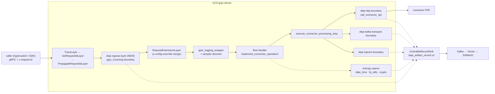
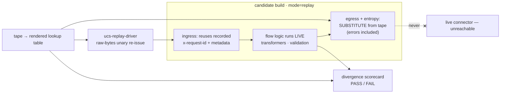

# RFC: Déjà record/replay integration in UCS

| | |
|---|---|
| **Status** | Draft |
| **Date** | 2026-08-12 |
| **Repo** | hyperswitch-prism (UCS) |
| **Library** | [juspay/deja](https://github.com/juspay/deja) (public, rev-pinned) |
| **Pattern reference** | hyperswitch integration (juspay/hyperswitch PRs #13285–#13289, #13439) — see Appendix A |

---

## 1. Summary

This RFC describes how UCS becomes deterministically replayable with [déjà](https://github.com/juspay/deja): in **record** mode, every boundary a request crosses — gRPC ingress, connector egress (HTTP / Kafka-transport / injector), and every entropy source (time, uuids, nonces, salts) — emits a structured event onto a tape; in **replay** mode, a candidate build re-runs recorded requests with all egress and entropy **substituted from the tape**, and a divergence scorecard reports exactly what changed.

The payoff is a **standalone connector regression gate**: record real sandbox traffic once, replay it against any connector change (including GRACE-generated PRs) with zero live PSP contact, and gate the PR on the scorecard instead of hoping the response looked right.

The architecture deliberately mirrors the proven hyperswitch integration (same macro idiom, same config shape, same Kafka envelope contract, same failure-policy asymmetry), adapted to UCS's structure. UCS is a substantially easier target: it is **stateless in the request path** (no database, no Redis, no in-memory business cache — verified), so the two hardest hyperswitch layers (DB capture with per-correlation schema routing; cache isolation) have no equivalent here.

## 2. Motivation

- **Connector regressions are invisible today.** A transformer change that alters an outbound field, drops a header, or reorders a flow is only caught if a test asserts that exact thing. Replay-with-scoring catches any behavioral divergence, asserted or not.
- **GRACE velocity needs a safety net.** Auto-generated connector changes need a gate that exercises real recorded traffic, not just golden tests.
- **Shadow-validation debugging.** Cross-service tapes (hyperswitch's + ours, joined on `x-request-id`) turn RouterData divergence hunts into diffable artifacts.

## 3. Goals and non-goals

**Goals**

1. Record: full-fidelity tape of every request boundary, decoded (UCS owns its protos — nothing on this tape is opaque).
2. Replay: byte-exact substitution; egress **never** re-issued (including recorded errors); scored divergences.
3. Zero production impact — see §4; this is the design's spine, not a feature.
4. Reuse the déjà envelope/lookup contracts unchanged so one compactor/dashboard serves every integrated service.

**Non-goals**

- Recording streaming RPCs (all payment flows are unary; streaming passes through unrecorded by design).
- HTTP service mode (`ServiceType::Http` / axum path) capture — follow-up; the seams are shared, only the ingress middleware differs.
- Tape encryption / redaction — a déjà-level workstream; until it lands, recording is **sandbox-only** (§10).
- Observability egress (tracing-kafka log shipping, OTLP metrics) — not request semantics, never recorded.

## 4. The prime invariant: normal working is never affected

Every mechanism below is load-bearing and independently enforced:

| # | Guarantee | Mechanism | Enforced by |
|---|---|---|---|
| 1 | Feature-off builds are unchanged | `deja` is an optional, rev-pinned git dep behind per-crate cargo features; every code change is `#[cfg(feature = "deja")]` / `#[cfg_attr]` | `cargo tree -p grpc-server` diff (zero deja crates); config purity test (§6.1); CI builds both arms |
| 2 | Feature-on but not booted = inert | Every boundary's first check is `observation_is_active()`; no hook installed ⇒ pure passthrough (no buffering, no allocation) | Passthrough parity tests per boundary |
| 3 | Recording never blocks or fails a request | Bounded producer buffers (full buffer = counted drops, never OOM), `SinkPolicy::FailOpen`, panic firewall around capture, serialization failure ⇒ marker + unaltered result | Failure-policy matrix (§11) + tests |
| 4 | Replay never silently runs live | Replay misconfig aborts boot; egress lookup miss = scored divergence, never a live call; replay+production config combination is rejected at validation | Fail-loud boot tests; `DejaConfig::validate` |
| 5 | A request header can never enable recording | `deja` config field is `#[patch(ignore)]`; the generated `ConfigPatch` derives `deny_unknown_fields`, so an `x-config-override` mentioning `"deja"` is **loudly rejected**, not merged | ConfigPatch rejection test |
| 6 | Production images unaffected by default | Dockerfile pins an explicit feature list (`kafka,connector-request-kafka,otel`); enabling deja is a two-token, single-file, revertible diff landed as its own commit | Release checklist |

Additional rule inherited from the reference integration: **nothing records at runtime until the final rollout PR installs the boot hook** — the earlier PRs are inert even feature-on, reviewable purely as code.

## 5. Architecture overview

### 5.1 Record mode



### 5.2 Replay mode



Correlation is the `x-request-id` the caller sends (the same id keying hyperswitch's own tape, so cross-service traces join in the compactor). Lookups resolve by déjà's rank-2 **span-path + occurrence** addressing, so un-seamed entropy degrades to a *scored divergence*, never a lookup miss that would go live.

## 6. Detailed design

Six workstreams. All file references verified against the current tree.

### 6.1 Foundation — features, config, purity proof

**Feature ladder.** One rev-pinned entry in `[workspace.dependencies]`; `dep:deja` only in crates that host attribute-macro sites; everything else forwards:

```toml
# workspace Cargo.toml
[workspace.dependencies]
deja = { git = "https://github.com/juspay/deja", rev = "<pin — align with hyperswitch main>" }
```

| Crate | Feature line | Why |
|---|---|---|
| `common_utils` | `deja = ["dep:deja"]` | time/id/crypto seams live here |
| `domain_types` | `deja = ["common_utils/deja"]` | forwarding (`generate_random_bytes` seam via helper) |
| `interfaces` | `deja = ["common_utils/deja", "domain_types/deja"]` | forwarding |
| `connector-integration` | `deja = ["dep:deja", "interfaces/deja", …]` | transformer seams (later batches) |
| `external-services` | `deja = ["dep:deja", …]` | egress boundaries |
| `ucs_env` | `deja = []` | **dep-free**: `DejaConfig` is plain serde types |
| `ucs_interface_common` | `deja = ["common_utils/deja"]` | request-id seam |
| `grpc-server` | `deja = ["dep:deja", "dep:deja-core", "dep:rdkafka", <all of the above>]` | umbrella: ingress, boot, sink, sampler |

Orthogonal to existing features (`kafka`, `connector-request-kafka`, `otel`, `injector-client`) — `deja` implies none of them. `cargo hack --each-feature` (Makefile) gains one variant per crate; CI's `clippy --all-features` compiles the deja arm on every PR.

**`DejaConfig`** (`crates/common/ucs_env/src/deja_config.rs`, module cfg-gated in `lib.rs`; field on `Config`):

```rust
#[cfg(feature = "deja")]
#[serde(default)]
#[patch(ignore)]                 // ← never enters the generated ConfigPatch
pub deja: crate::deja_config::DejaConfig,
```

Shape mirrors hyperswitch's `DejaSettings`: `mode` (`disabled` default | `record` | `replay`), `run_id`, `recording.kafka` (topic, brokers, `acks="all"`, `idempotence=true`, bounded buffering caps), `replay` (source, lookup_dir), `sampler` (record_key, fail_closed=true — **no timeout_ms**, see §6.5), `identity`, `writer` (queue 8 192 / batch 500 / flush 1 s). `DejaConfig::validate()` rejects `(Replay, Env::Production)` and `(Record, no brokers+no inheritance)` at boot. Env vars follow the existing scheme (`CS__DEJA__MODE=record`), with a cfg-gated `with_list_parse_key("deja.recording.kafka.brokers")` on the loader's env source.

**Patch exclusion is hard and loud.** The override path (`x-config-override` → `merge_config_with_override` → `serde_json::from_str::<ConfigPatch>`) meets two independent walls: `#[patch(ignore)]` means no `deja` field or apply-statement is ever generated (precedent: `superposition_config` uses the same), and the generated `ConfigPatch` is `#[serde(deny_unknown_fields)]`, so an override JSON containing `"deja"` **fails deserialization** and the request is rejected with `InvalidDataFormat`. A regression test pins this.

**Feature-off purity test** (`crates/common/ucs_env/tests/deja_config_purity.rs`, compiled in the **default** build): load `config/development.toml` twice through the real loader — once with `[deja]` stripped, once with an aggressively populated `[deja]` block injected — and assert the resulting `Config`s serialize to byte-identical canonical JSON. A canonicalizer (recursive key-sort + scalar-array sort) is required: `Config` contains HashMap/HashSet fields and the workspace enables serde_json `preserve_order`. Companion `#[cfg(feature = "deja")]` tests assert the injected block round-trips and the ConfigPatch rejection.

> Note: true binary byte-identity is not hash-verifiable in this repo (vergen stamps the git sha into every build). The enforceable proxies are the cargo-tree diff, the purity test, and cfg-gating review.

### 6.2 Correlation substrate + gRPC ingress boundary

**Module layout** (all `#[cfg(feature = "deja")]`): `crates/grpc-server/grpc-server/src/deja/{mod,ingress,decode,sampler,boot,record_sink}.rs`. The ingress layer lives in grpc-server (not external-services): it is tonic-transport-specific, needs `grpc_api_types::FILE_DESCRIPTOR_SET`, and grpc-server already owns the sibling middleware (`config_overrides.rs` is the implementation template — the chain is monomorphic: `Service<http::Request<tonic::body::Body>, Response = http::Response<tonic::body::Body>, Error = tonic::Status>`).

**Chain position** — spliced **after `PropagateRequestIdLayer`, before `RequestExtensionsLayer`** (`app.rs` ~315):

- *Inside* `SetRequestIdLayer`: the buffered request always carries a concrete `x-request-id` (`MakeRequestUuid` fills it), so a server-generated id becomes part of the recording — replaying the recorded request re-presents the same id and set-if-missing won't mint a new one. The biggest ingress nondeterminism disappears structurally.
- *Outside* `RequestExtensionsLayer`: that layer can short-circuit with a `Status` on a bad `x-config-override`; being outside preserves one-event-per-request even for rejected requests. The override header itself is captured verbatim in the event's metadata (it is part of request identity — two identical payloads under different overrides are different requests).

**Behavior.** Inactive (`!observation_is_active()` or excluded path): `return Box::pin(self.inner.call(req))` — no buffering, no body wrap, no allocation. Active: buffer the unary request (size-capped ~4 MiB, matching tonic's default max message size; over-cap ⇒ passthrough with a lossy-marked event, never an error), open the event, rebuild the request over the same buffer, forward; capture response frames via a `CaptureBody` wrapper (tees `Data`/`Trailers` as the client polls — backpressure preserved); finalize at end-of-stream/trailers (`grpc-status` lives in trailers) or on `Drop` (client disconnect ⇒ finalized as aborted). Structural exclusions: `/grpc.health.v1.Health/*`, `/grpc.reflection.*`, any streaming rpc (none exist today — verified against the protos).

**Proto decode — no build changes needed.** `grpc-api-types/build.rs` already emits a descriptor set and `src/lib.rs` exports it as `FILE_DESCRIPTOR_SET` (it already feeds tonic-reflection). `deja/decode.rs` builds a `prost_reflect::DescriptorPool` from it once, indexes `rpc path → MessageDescriptor`, strips the 5-byte gRPC frame header, and decodes to spec-canonical proto3-JSON. Decode failure degrades to base64 raw bytes in the event — capture never fails a request. (Server-generated types were rejected: their serde output is g2h-flavored JSON and would need a hand-maintained 17-service registry.)

**Correlation layer.** In `ucs_env::logger::setup`, pushed only when `deja::process_mode().is_observing()` — zero subscriber overhead otherwise. One wiring subtlety: `TraceLayer` sits *outside* `SetRequestIdLayer`, so when the client omits `x-request-id` the span's `request_id` field is still `Empty` at span creation; the ingress layer's active arm therefore does `Span::current().record("request_id", …)` from the now-guaranteed header, which fires the correlation layer's `on_record`. Existing layer order is **not** changed (that would alter feature-off behavior).

**Request-id seam** (`ucs_interface_common/src/metadata.rs` ~266): in the gRPC path the header is guaranteed by the time `request_id_from_metadata` runs, so the `generate_uuid_v7()` fallback only fires on edge paths — but it must still be deterministic: on replay, reaching the fallback at all is a divergence (the recorded request always carries the id) ⇒ fail loud; on record, the generated id is observed onto the tape.

**Sampler seam.** Pushed in `grpc_logging_wrapper` / `grpc_logging_wrapper_with_parser` immediately after `RequestData::from_grpc_request` succeeds (request_id now known). Gates on **boot-time `process_mode() == Record`**, never the per-correlation mode — the per-correlation mode is *derived from* the decision this call pushes; consulting it is circular (and on replay the decision comes from the tape, so the sampler must not run at all). An RAII `DecisionGuard` clears the decision on the abnormal path (cancel/panic); on normal return it is defused and déjà's event-finalize consumes the entry. `implement_connector_operation!` needs **no changes**.

### 6.3 Egress boundaries ×3

All egress branches from `execute_connector_processing_step` (`external-services/src/service.rs` ~574) on `(CallConnectorAction, TransportType)`.

**Policy: always-substitute, both arms.** On replay every egress boundary substitutes the recorded outcome — `Ok(Ok)`, `Ok(Err(Response))`, and `Err(Report<…>)` — without executing the body. A recorded typed error (timeout, 503, Kafka unknown-500) is part of the scenario under test, not an artifact to retry. Record mode and feature-on-without-hook are pure passthrough.

**Transport 1 — HTTP: annotate `call_connector_api` directly** (`service.rs` ~1152). Two hyperswitch complications verified absent in UCS:

- *No body smuggle needed.* Hyperswitch's `send_request` returns a streaming `reqwest::Response`, forcing eager-buffer + `http::Extensions` smuggling. UCS's `handle_response` (~1593) already calls `resp.bytes().await` on every arm and returns a fully materialized `domain_types::Response { status_code, headers, response: Bytes }` — one buffer, tape and caller trivially identical.
- *No fn split needed.* Everything args-capture needs (`method`, `url`, `headers`, `body`) is in scope at fn entry.

Placement below the step function means the TestConfig `mock_server_url` rewrite, shadow-mode headers, metrics, and the masked `ConnectorCall` audit event all run identically in record and replay — the tape captures the *final* wire request, and audit events are unaffected.

Args (`Secret<serde_json::Value>`-wrapped; mTLS `certificate*` fields **never** captured): method; URL (post-rewrite; the `x-api-url` header preserves the original); headers collected from the `HashSet<(String, Maskable<String>)>` and **sorted by (name, value)** (set iteration order is nondeterministic — unsorted headers would randomize identity); body by `RequestContent` variant — `Json`/`FormUrlEncoded`/`Xml` as exposed inner value, `RawBytes` as base64 (not `get_inner_value()`, which returns empty for non-UTF8), `FormData` as the **structured** `MultipartData` (never `render_as_bytes()`, whose multipart boundary is freshly random per call).

Result codec — no serde on `Response` itself (`http::HeaderMap` isn't serde); a mirror type in a new `external-services/src/deja_codec.rs`:

```rust
#[derive(serde::Serialize, serde::Deserialize)]
pub enum HttpTapeOutcome {
    Ok(TapeResponse),           // 2xx/302/204 arm
    HttpErr(TapeResponse),      // inner Err(Response): 4xx/5xx — must round-trip
    ClientErr(ApiClientError),  // outer Report<ApiClientError>
}
// TapeResponse { status_code, headers: Option<Vec<(String,String)>> (sorted), body_b64 }
```

`ApiClientError`/`KafkaClientError` (common_enums) gain cfg-gated serde derives (all variants are unit/String-shaped). Losing `error_stack` attachments on error round-trip is verified safe: both error mappers branch only on `current_context()` — a comment at those fns pins the assumption.

**Transport 2 — Kafka** (`TransportType::Kafka` flows): the boundary wraps the single call site's path through `publish_to_kafka` (which exists as the real impl and as a feature-off stub — the wrapper covers both, so `deja` composes with `connector-request-kafka` on/off and tapes are portable across the two). Recorded value: the **classified synthetic `Response`** from `classify_kafka_delivery_result` (queued/rejected/unknown) — exactly what the caller consumes. Replay publishes nothing; a replay rig must also skip `init_kafka_producer` (its startup `fetch_metadata` probe is egress).

**Transport 3 — Injector** (`injector-client` feature, vault-card-proxy flows): boundary on a wrapper around exactly `injector_core`. `InjectorResponse` already derives serde — the Ok arm round-trips natively; the error arm encodes `(variant, Display)` and decodes to one canonical variant — behavior-identical because the sole call site collapses every error via `change_context`. **Maximum tape sensitivity**: args capture stores only endpoint, method, and SHA-256 digests of template/headers/token identifiers (span-path addressing doesn't need arg plaintext); injector events carry a `sensitivity: vault` tag; recording them is opt-in (default off) until tape encryption exists.

**Audited non-boundaries** (checked, no hooks needed): `VerifyWebhookSource` routes through the step function (covered by HTTP boundary); `HandleResponseWithoutBuildRequest` performs zero egress; client/proxy construction does no I/O at build time; `composite-service` issues no HTTP; observability egress is out of scope by policy.

### 6.4 Entropy seams

**Shared helpers** (UCS-2 scope; zero connector diffs — everything funnels through four modules):

| Helper | Seam | Codec note |
|---|---|---|
| `date_time::now()` / `now_unix_timestamp()` | `deja::time` | nanos values are i128 → **16-byte BE bytes codec** (`serde_json::Number` silently nulls >u64 — the hyperswitch nonce lesson) |
| `fp_utils::generate_id*`, `generate_uuid_v7`, **new** `generate_uuid_v4` | `deja::id` | String |
| `crypto::generate_cryptographically_secure_random_string/bytes` | `deja::id` | bytes; const-generic support to confirm (fallback: non-generic `fill_random_bytes` inner seam) |
| `crypto::NonceSequence::new` | seam the **byte-fill**, not the u128 | extract `generate_gcm_nonce_bytes() -> [u8;12]` |
| `jose.rs` claim validation | via seamed `now_unix_timestamp()` | the other five `now_utc()` sites in jose.rs are `#[cfg(test)]` — skip |
| `domain_types::utils::generate_random_bytes` | `deja::id` | bytes (covers placetopay's nonce for free) |

All seams get `#[cfg_attr(feature = "deja", track_caller)]`; deterministic crypto (HMAC, RSA-PKCS1 signing) re-runs live over substituted inputs — no seam.

**Connector inventory (measured):** ~61 direct entropy sites across 32 connectors / 36 files — 24× `OffsetDateTime::now_utc()`, 21× `Uuid::new_v4()`, 8× `SystemTime::now()`, 5× `thread_rng`, 3× ring `SystemRandom` (two of which are RSA-PKCS1 signing RNGs — deterministic output, lint-allow only). By purpose: ~22 signature/HMAC inputs, ~21 idempotency/client-request ids, ~15 payload timestamps.

**Migration** (UCS-4, trails everything else safely — un-migrated sites score as arg divergences, never lookup misses): mechanical swaps to the seamed free functions, **signed-request sites first** — priority order: paytm (SystemRandom signature salt), rapyd + globalpay + authorizedotnet (`thread_rng` salts/nonces), grabpay (RFC7231 HMAC date), fiserv (millis + uuid, both HMAC inputs), the cybersource family HTTP-Signature dates (cybersource / bankofamerica / barclaycard / wellsfargo / payout-cybersource), deutschebank CSEAL date, paybox/qwikcilver signature timestamps. Idempotency-key uuid sites migrate to the new `generate_uuid_v4()` (do **not** silently switch to v7 — some processors validate format). No per-connector plumbing: request building runs inside the instrumented flow span, so span-path + `track_caller` addressing works as-is.

**Enforcement lint** (lands with the first migration batch): new root `clippy.toml` with `disallowed-methods` (`OffsetDateTime::now_utc`, `SystemTime::now`, `Uuid::new_v4/now_v7`, `rand::thread_rng`, `SystemRandom::new`) + `disallowed-types` (`OsRng`), wired through the existing `[workspace.lints.clippy]` at `warn`, flipped to `deny` once batches land. Seam interiors carry `#[allow(clippy::disallowed_methods)] // deja seam interior` (~8 sites) plus targeted allows for the RSA signing RNGs and the non-seam list.

**Must-NOT-seam** (observability, excluded via `reply_canon` projection instead): audit-event timestamps (`service.rs` ~1115, grpc `utils.rs` ~510), all `tokio::time::Instant` latency tracking, `date_time::time_it`. One open item: `josekit`'s JWE encryption generates CEK/IV internally — unseamable without wrapping the library; accept as a projected/scored divergence for flows that emit JWE (decision needed, §12).

### 6.5 Sink, boot, sampler

**Boot install point — precisely between the version stamp and `logger::setup`** in `main.rs`. The hook is a `OnceLock`: anything that peeks it before install latches "no hook" for that path forever. The audit of what runs before serve: config parse, `git_describe!`, superposition file load — none crosses a seam; `logger::setup` is the first consumer (the execution-graph layer peeks the hook at subscriber-build time), so install must precede it. `deja/boot.rs` itself uses raw `SystemTime`/`process::id()` for identity fallbacks so it can never recurse into seams.

```rust
#[cfg(feature = "deja")]
let report = grpc_server::deja::boot::install(&config.deja, Some(&config.events.brokers))
    .map_err(|e| /* replay misconfig: abort boot */)?;
```

- **Disabled** → installs the disabled hook (mode latched).
- **Record, fail open**: missing topic / empty brokers / producer-creation failure → `eprintln!` (logger not up yet) + disabled hook + boot continues. Payments are never blocked by instrumentation.
- **Replay, fail loud**: any misconfiguration → `Err` → abort before `logger::setup`.

Identity: `run_id` from config else `run-{now_ns}`; `instance_id` from config → `runtime_metadata.pod_name` (already Downward-API-fed) → pod-name env → `pi-{pid}-{now_ns}`; `code_sha` from config → `VERGEN_GIT_SHA` (already stamped by grpc-server's build.rs) → `"unknown"`. Broker inheritance: explicit `deja.recording.kafka.brokers` wins; empty inherits `config.events.brokers` (shared cluster provisioning, **dedicated** producer).

**`UcsKafkaRecordSink`** (`deja/record_sink.rs`): near-verbatim port of the hyperswitch sink, because the envelope is a **cross-repo contract** with the déjà compactor. Dedicated `ThreadedProducer` (never the audit producer; deliberately no constructor `fetch_metadata` probe — a probe failure must fail open, not hang boot), hardened (`acks=all`, idempotence, `message.timeout.ms`, bounded `queue.buffering.max.messages/kbytes`). Three envelopes on one topic — `deja_artifact_record` v2 / `deja_graph_node` v1 / `deja_sink_marker` v2 — partition-keyed by correlation id (else `run_id:global_sequence`), Kafka headers carrying sequence/run/boundary/method so Vector routes without parsing. Flush: cadence = 50 ms best-effort poll (timeout ⇒ Ok); **only the EOF marker does a real 10 s drain**. Envelope JSON shape pinned by ported tests. Open item: emit an explicit flush on SIGTERM after `try_join!` returns (writer-drop EOF alone is fragile).

**Sampler — synchronous, no timeout.** A genuine simplification over hyperswitch: prism evaluates Superposition **in-process** from the boot-loaded `superposition.toml` (`eval_config` is a pure local function — no network, no cache). So: drop `timeout_ms` entirely; `should_record(rpc_path) -> bool` is a plain sync call, memoized per rpc method (the method set is finite and the file is immutable after boot). Logic: structural exclusion first (any path not under `/ucs.` — health, reflection); then eval `deja_record` with dims `{environment, rpc_method}`; eval error or absent superposition ⇒ `!fail_closed` (default: don't record). `superposition.toml` gains `deja_record = false` default, an `rpc_method` dimension, and explicit sample-in overrides per environment+method.

**Release enablement**: append `,deja` to the two `--features` lines in the Dockerfile (chef cook + build) — a two-token, instantly revertible diff, its own commit, landed only after everything else is green. `Makefile` local builds remain feature-off.

### 6.6 Replay driver

**New crate `crates/internal/replay-driver`** (bin `ucs-replay-driver`) — not a bin inside integration-tests (it must build into a small runner container without scenario/creds machinery). Depends on `deja-kernel` *as a library* (correlation grouping, `diff_json`, the diff artifact schema), `grpc-api-types` (`FILE_DESCRIPTOR_SET`), `prost-reflect`, `tonic`.

**Transport: raw-bytes unary re-issue.** Recorded ingress is wire bytes; the driver re-issues them verbatim via `tonic::client::Grpc::unary` with an identity `Bytes` codec and the recorded rpc path — zero per-RPC code, exact-byte fidelity, new RPCs need no driver change. Metadata replayed verbatim (`x-request-id` = correlation id, `x-config-override`, connector auth, tenant/merchant; hop-by-hop headers stripped). Responses decode via the descriptor pool for field-level diffing.

**Order & isolation**: correlations driven in min-`global_sequence` order, serial within a correlation, bounded concurrency across. **Preflight enforces the prime invariant**: health-probe the candidate, then drive one canary correlation and require its ObservedCall to appear `resolved: true` in the observed sink — if the lookup table is unreadable or the canary resolves nothing, abort loudly before driving anything.

**Two boot modes**: `--target` (orchestrator/k8s: candidate container booted with `DEJA_MODE=replay` + mounted lookup/observed paths) and `--boot-local` for CI (hoist integration-tests' ~90-line in-process server spawn into a small shared internal crate; replay env set **before** `Service::new`).

**CI gate shape**: nightly `replay-record.yml` runs the sandbox suites against a record-enabled build (local JSONL sink — no Kafka in CI) and uploads the tape; `replay-gate.yml` on connector-path PRs fetches the tape, filters correlations for the touched connector (recorded `x-connector` metadata), renders a scoped lookup table, boots the candidate from the PR branch, drives, scores, and gates with a sticky PR comment. Sandbox tapes only; replay egress fully substituted.

## 7. Changes required in déjà itself

The core is transport-agnostic — `SemanticEvent` boundary kinds are free-form strings (`"grpc_incoming"` needs no schema change), and the address ladder, correlation layer, writer/sinks, envelope, and macro family all apply unchanged. Three real gaps were located by reading the déjà source:

| ID | Gap (with the hardcoded sites) | Change | Size | Fallback |
|---|---|---|---|---|
| **D3** | Ingress-root recognition: the lookup renderer does `if boundary == "http_incoming" { continue; }` and advances its occurrence/sequence counters only for non-ingress events — a `grpc_incoming` event on a tape today would be rendered *into* the table and silently shift every subsequent lookup key. Blast radius: kernel find, renderer skip, `LookupTableHook::record` finalizer-forward, 4 divergence-scorer sites, scope classification, compactor `has_ingress` | A compile-time `INGRESS_BOUNDARIES: &[&str]` const + `is_ingress_root()` in deja-core, threaded through all 8 sites; fixture test with a gRPC tape | ~200 lines | Record UCS ingress **labeled** `http_incoming` with gRPC payload inside — works because every consumer except the kernel treats the string as a label; requires the D2-fallback driver and mislabels dashboards. Viable but ugly — D3 is small and should be **déjà PR-1** |
| **D1** | No gRPC adapter: the tonic primitives (buffered bodies replaying through tonic's decoder, frame parsing, wire canonicalization, `GrpcResultEnvelope`) exist only inside hyperswitch's `external_services` (~1,100 lines from its egress boundary) | New `deja-tonic` crate: `wire` + `egress` hoisted from the hyperswitch code, plus a new `ingress` tower layer; descriptor decoding injected as a closure so the crate stays proto-agnostic | ~1,400 lines | Implement the ingress layer + vendored wire utils inside `grpc-server` behind the same feature (exactly how hyperswitch keeps its transport code today); hoist later |
| **D2** | `deja-kernel` re-drives ingress as HTTP only (`reconstruct_driver_request` parses an HTTP-shaped payload) | An `IngressDriver` trait (boundary / reconstruct / drive / compare) with the HTTP impl extracted mechanically; tonic impl lives in deja-tonic or UCS | ~800 lines | **Solid**: the UCS driver links deja-kernel as a library and writes the same diff-sink JSONL — a drop-in runner image; no kernel changes needed |
| D4 | Proto-aware diff projections (enum name/number equivalence, default-vs-absent) | Descriptor-aware canonicalization in the scorer | later | Generic JSON diff works day one |
| D5 | Cross-service trace join (hyperswitch + UCS tapes on `x-request-id`) | Multi-source run manifests in the compactor | later | Not needed for the standalone gate |

**Handling:** one juspay/deja issue per item opened at UCS-1 time (so the ART owners weigh in on API shape before code); UCS pins déjà by rev and bumps as items merge; the envelope and lookup-table formats are versioned cross-repo contracts UCS never forks. **Sequencing:** D3 first (small, correctness-critical, unblocks everything); D1 during UCS-1→2 (or its in-repo fallback); D2 optional given its fallback. Worst case — every déjà PR stalls — the gate still ships: `http_incoming`-labeled ingress + vendored wire utils + standalone driver require zero upstream changes.

## 8. Rollout plan

Five stacked UCS PRs; each compiles feature-off byte-identical **and** feature-on; nothing records until UCS-5.

| PR | Scope | Done when |
|---|---|---|
| **UCS-1** Foundation | Feature ladder, `DejaConfig` (+`#[patch(ignore)]`), TOML blocks, purity test. Open déjà issues D1–D3 | Default `cargo tree` has zero deja crates; both builds green; purity + ConfigPatch-rejection tests pass in CI |
| **UCS-2** Correlation + ingress + shared seams | Correlation layer, ingress tower layer + decode, sampler seam + guard, seams on `common_utils`/`domain_types` helpers + request-id fallback | Feature-on-no-hook = passthrough (probe-body parity test); E2E with test hook: exactly N decoded events for N rpcs, zero for health/reflection; process-mode invariant + guard-cleanup tests |
| **UCS-3** Egress ×3 | HTTP boundary on `call_connector_api` + `deja_codec.rs`, Kafka wrapper, injector wrapper (digest-only args) | Parity test: byte-identical responses with feature on/off; codec round-trip property tests (BOM, non-UTF8, all error variants); replay test with mock server **stopped** and a zero-new-requests assertion |
| **UCS-4** Connector entropy migration | Batches: signed-request sites → uuid idempotency sites → payload timestamps; `clippy.toml` lint warn→deny | Lint enforced; top-traffic connectors self-replay with zero argument divergences |
| **UCS-5** Sink + boot + sampler + driver — recording goes live | `UcsKafkaRecordSink`, `deja_boot::install`, superposition sampler entries, `replay-driver` crate, CI workflows, Dockerfile `,deja` as isolated final commit | Sandbox workload records → self-replays with zero divergences; injected fault (altered response mapping) surfaces as an explicit divergence; fail-open/fail-loud boot tests; envelope-shape pin test |

## 9. Testing strategy

Layered, matching the invariant table in §4: **compile-level** (cargo-tree diff, `--each-feature` matrix, both-arm CI builds) → **purity** (config byte-equality feature-off) → **passthrough parity** (per boundary: feature-on-no-hook, probe bodies that panic on unexpected buffering; cross-build response-digest comparison) → **unit** (codec round-trips over adversarial values; sampler logic; envelope shape pins) → **E2E record** (real server, test hook, event counts + decodability) → **E2E replay** (record → stop mocks → replay → zero live calls, identical outcomes) → **fault injection** (altered mapping ⇒ explicit divergence; proves the gate detects, not just passes).

## 10. Security & PCI posture

UCS tapes are **more sensitive than hyperswitch's**: recorded connector HTTP bodies carry full PAN/CVV; ingress metadata carries connector auth in full fidelity (déjà's redaction is a deferred workstream everywhere). Positions taken by this design: recording is **sandbox-only** until tape encryption lands; production enablement is a PCI-scoped decision, not a config flip; injector (vault) events capture argument **digests only** and are opt-in even in sandbox; mTLS key material is never captured; `Secret`-wrapping ensures captured payloads are redacted in any Debug/log path (the tape sink is the only deliberate exposure); a request header can never enable recording (§4.5).

## 11. Failure-policy matrix

| Scenario | Mode | Policy |
|---|---|---|
| Sink down / buffer full | record | fail open — counted drops + `dropped` markers |
| Event serialization fails | record | marker on tape; caller gets unaltered result |
| Capture code panics | record | panic firewall; request unaffected |
| Ingress body over size cap | record | passthrough + lossy-marked event |
| Proto decode fails | record | base64 fallback in event |
| Sampler eval error | record | fail closed — don't record this request |
| Boot misconfig (topic/brokers) | record | fail open — disabled hook, normal boot, stderr |
| Boot misconfig (tape path) / replay+production | replay | **fail loud — abort boot** |
| Egress lookup miss | replay | scored divergence; **never** a live call |
| Driver preflight canary unresolved | replay | abort before driving |
| Request-id fallback reached | replay | fail loud (divergence — recorded requests always carry the id) |

## 12. Open questions

1. **Déjà macro surface**: do the current attribute macros expose `substitute`/`codec` options as sketched, or do boundaries need the thin shell-fn split (fallback already designed)? Confirm against the pinned rev; affects UCS-3 shape only.
2. **josekit JWE entropy** (internal CEK/IV): accept as projected divergence vs wrap the library — needs a decision before UCS-4 touches JWE-emitting flows.
3. **`superposition_core` pin**: the workspace tracks `branch = "main"` — a build-stability risk independent of déjà. Recommend a rev pin alongside UCS-1.
4. **Connector-cred masking vs lookup identity**: if auth material enters hashed egress args, record-time masking would break lookups — the egress args design (§6.3) must be validated against this during UCS-3 review.
5. **SIGTERM flush**: explicit EOF flush on shutdown vs writer-drop only.
6. **Decision-guard lifecycle**: confirm déjà's event-finalize consumes pushed decisions (the defuse design assumes it).
7. **HTTP service mode**: sampler/ingress currently define gRPC paths only; HTTP mode is explicitly out of scope — revisit if it ever serves recorded traffic.

---

## Appendix A — Pattern reference: the hyperswitch integration

Kept for reference only; this RFC stands on UCS's own structure. Patterns adopted: rev-pinned optional dep + feature ladder, config purity proof, span-based correlation, `process_mode()`-not-`mode()` ingress gating, sorted-header identity, `Secret`-wrapped captures, typed-error codecs, dedicated hardened Kafka producer + envelope contract, boot-before-consumers install, fail-open-record / fail-loud-replay, Superposition sampler, isolated revertible release-enable commit. Deliberate deviations: **always-substitute egress including errors** (hyperswitch's HTTP boundary is Ok-only; its gRPC boundary #13439 is always-substitute — we follow the latter), **synchronous sampler** (superposition is in-process here), **no body-smuggle** (UCS responses are already materialized), **decoded ingress events** (UCS owns its protos; closes hyperswitch's "D2" opaque-UCS-payload gap from this side), and **per-request config captured into ingress identity** (`x-config-override` has no hyperswitch equivalent).

## Appendix B — Verified touch-point index

| Concern | Location |
|---|---|
| tonic layer chain | `crates/grpc-server/grpc-server/src/app.rs` ~281 (template: `src/config_overrides.rs`) |
| flow wrapper / sampler push | `crates/grpc-server/grpc-server/src/utils.rs` ~335 (`grpc_logging_wrapper`), ~596 (`implement_connector_operation!`) |
| span fields | `crates/grpc-server/grpc-server/src/utils.rs::record_fields_from_header` ~32 |
| request-id fallback | `crates/types-traits/ucs_interface_common/src/metadata.rs` ~266 |
| config struct / loader | `crates/common/ucs_env/src/configs.rs`; patch derive: `crates/common/config_patch_derive` |
| egress step / HTTP choke point | `crates/common/external-services/src/service.rs` ~574 / ~1152 / ~1593 |
| Kafka transport | `crates/common/connector_request_kafka/src/lib.rs` (~100 `publish_to_kafka`) |
| shared entropy | `common_utils` `lib.rs` (date_time), `fp_utils.rs`, `crypto.rs`, `crypto/jose.rs`; `domain_types/src/utils.rs` ~111 |
| descriptor set | `crates/types-traits/grpc-api-types/src/lib.rs` (`FILE_DESCRIPTOR_SET`) |
| superposition eval | `crates/common/common_utils/src/superposition_config.rs` (~105 `eval_config`) |
| boot sequence | `crates/grpc-server/grpc-server/src/main.rs` (install between version stamp and `logger::setup`) |
| kafka writer precedent | `crates/common/tracing-kafka/src/writer.rs` ~134 |
| candidate boot pattern | `crates/internal/integration-tests/src/harness/server.rs` |
| release features | `Dockerfile` lines ~47/~60 |
| déjà hardcoded ingress sites | deja: `deja-kernel/src/lib.rs` (`reconstruct_driver_request`), `deja-orchestrator/src/lookup/mod.rs` (renderer skip), `deja-runtime/src/replay.rs` ~2128, `deja-orchestrator/src/divergence/mod.rs` (4 sites), `scope.rs`, `deja-compactor/src/lib.rs` (`has_ingress`) |
