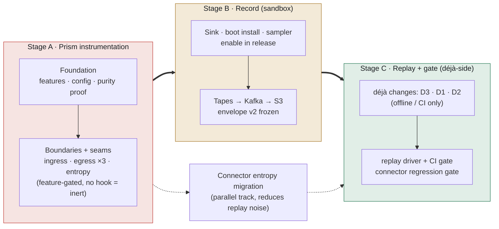

# Proposal: phased rollout of déjà record/replay in UCS

| | |
|---|---|
| **Audience** | Architecture review |
| **Author** | ARTINUCS |
| **Date** | 2026-08-12 |
| **Decision sought** | Approve a **prism-first, record-first** rollout; approve the sandbox-only data posture; assign ownership + timing for the déjà-side (replay) work |
| **Companion** | Technical detail in [`deja-ucs-integration.md`](./deja-ucs-integration.md) (the full RFC). This doc is the sequencing decision only. |

---

## 1. Recommendation (the ask)

Roll out in three stages, in this order:

> **Stage A — Instrument UCS for recording** (prism-side only) → **Stage B — Turn on recording in sandbox** → **Stage C — Build replay + the connector regression gate** (déjà-side).

The central reason this order is correct — not merely convenient:

- **Recording requires zero changes to the déjà library.** All of the risky work — the part that adds code to the live payment path — is confined to UCS and builds against déjà's existing API.
- **Every déjà-library change is on the replay side**, which is entirely **offline / CI** and touches nothing in production. It can be built last, by whoever owns déjà, using real recorded tapes as the contract.

So this ordering front-loads the production-risk surface (instrument, prove inert, prove safe under real traffic), then builds the offline machinery on top of a proven, stable foundation. It also decouples two teams cleanly: once Stage B emits tapes, the déjà-side work in Stage C has a concrete artifact to build against.

We are asking the architect to approve this sequence and the decisions in §6.

## 2. Why this order (vs the alternatives)

| Approach | Problem |
|---|---|
| **Déjà-first** (build replay tooling, then instrument) | Builds offline machinery against *speculated* tape shapes; nothing is validated until UCS is also instrumented; the upstream team is blocked on us anyway. |
| **Big-bang** (one branch: instrument + record + replay + déjà changes) | The production-path instrumentation and the upstream library churn land together — impossible to review the "never affect payments" guarantee in isolation, and a déjà-side slip blocks the whole thing. |
| **Prism-first, record-first** (recommended) | The production-touching code lands and bakes first, proven inert then proven safe; recording has standalone value on day one; the déjà-side work is last, smallest, offline, and scoped by real tapes. |

The recommended order is the only one where the payment-path changes are reviewable and shippable **independently** of any upstream library work.

## 3. The three stages

### Stage A — Instrument UCS for recording *(prism-side, no déjà changes)*

Add the feature ladder, `DejaConfig`, and the feature-off purity proof; then the gRPC ingress boundary, the three egress boundaries (connector HTTP, Kafka-transport, injector), correlation wiring, and the shared entropy seams. **All feature-gated; with no hook installed everything is a pure passthrough**, so even feature-on the binary behaves exactly as today.

- **Touches the live payment path** — this is the stage that needs the "never affect normal working" review (see §5).
- **Proven here:** feature-off byte-identical builds; per-boundary passthrough parity; and **per-boundary record→replay round-trip** in-process (`LookupTableHook` — this works with stock déjà, so the substitution mechanism is validated at unit level *before* any déjà-side work).
- **Not yet proven here:** full-request replay driven end-to-end (that needs Stage C).
- **Déjà changes: none.**

### Stage B — Turn on recording in sandbox *(prism-side, no déjà changes)*

Add the dedicated Kafka record sink, the boot-time hook install (fail-open on record, fail-loud on replay), the Superposition sampler, and the isolated release-enable commit. Recording begins in sandbox behind the sampler.

- **Milestone deliverable:** tapes flowing to object storage, and proof the instrumentation is safe under real traffic. **This milestone stands on its own** — tapes are immediately useful as forensic artifacts (e.g. debugging shadow-validation / RouterData divergences) even before replay exists.
- **Freeze the envelope schema (v2)** here — it is the cross-repo contract with the déjà compactor and the input to Stage C.
- **Déjà changes: none.**

### Stage C — Build replay + the connector regression gate *(déjà-side)*

Now, and only now, the déjà-library work: generalize ingress-root recognition (**D3**, the one correctness-critical upstream change), optionally hoist the tonic adapter (**D1**) and the kernel ingress-driver trait (**D2**) — each with a UCS-side fallback if upstreaming stalls. Then the UCS replay-driver crate and the CI gate.

- **Entirely offline / CI. Touches nothing in production.**
- **Scoped by real tapes** from Stage B, not by guesswork.
- **Delivers:** record sandbox traffic once → replay against any connector change (including GRACE PRs) → divergence scorecard gates the PR, with zero live-PSP contact.

*Parallel track — connector entropy migration:* migrating the ~61 direct entropy call sites across 32 connectors to seamed helpers reduces replay noise. It can start after Stage A and overlap B/C; un-migrated sites are safe meanwhile (they score as divergences, never cause live calls). No déjà changes.

## 4. What is proven at each milestone

Being precise so nothing is over-promised:

| After | We can assert | We cannot yet assert |
|---|---|---|
| **Stage A** | Feature-off is byte-identical; feature-on-no-hook is a pure passthrough; each boundary captures and substitutes correctly in-process | That a full recorded request replays end-to-end |
| **Stage B** | Recording is safe under real sandbox traffic; tapes are well-formed, decoded, and complete; two recordings of the same request agree modulo seams | (same — full replay still pending) |
| **Stage C** | A recorded request replays against a candidate build and divergences are scored; the gate blocks regressing PRs | — |

**Optional de-risking spike (between A and B):** a few days to run one recorded correlation through an offline replay using the D3 *fallback* (label ingress as `http_incoming`) and a throwaway driver — this validates end-to-end tape sufficiency before committing to the Stage B production rollout, without waiting for the full Stage C. Recommended if the architect wants replay evidence before enabling recording.

## 5. The standing guarantee: normal working is never affected

This holds across every stage and is the spine of the design (full matrix in RFC §4):

1. **Feature-off = unchanged** — déjà is an optional rev-pinned dep behind cargo features; every edit is `#[cfg(feature = "deja")]`. Default `cargo tree` shows zero déjà crates.
2. **Feature-on-no-hook = inert** — every boundary's first check is `observation_is_active()`; nothing records until Stage B installs the hook.
3. **Recording never blocks or fails a request** — bounded buffers (full buffer = counted drops, never OOM), fail-open sink, panic firewall around capture.
4. **Replay never runs in production** — replay misconfig aborts boot; replay+production config is rejected at validation; replay tooling is offline-only.
5. **A request header can never enable recording** — the `deja` config field is excluded from the per-request override surface and any override mentioning it is *rejected*, not merged.
6. **Production images unaffected** — the Dockerfile pins an explicit feature list; enabling déjà is a one-line, revertible commit landed last.

## 6. Risks and decisions needed

| # | Item | Recommendation / ask |
|---|---|---|
| 1 | **Data sensitivity.** UCS tapes carry full PAN/CVV in connector requests and connector auth in metadata. | **Sandbox-only** until déjà tape-encryption lands; injector (vault) args captured as **digests only** and opt-in; short tape retention. **Architect to confirm** the sandbox-only posture and name a PCI-scope owner for any future production ask. |
| 2 | **Ownership of the déjà-side (Stage C) work.** | Decide: do we upstream D1–D3 to `juspay/deja` ourselves, or does the déjà/ART team own it? Each has a UCS-side fallback, so Stage C is **not hard-blocked** either way — but the owner and timing should be set at Stage A kickoff so issues can be opened early. **Architect to assign.** |
| 3 | **Envelope schema freeze.** Tapes recorded before the schema is final can't be replayed later. | Freeze envelope **v2** (already the cross-repo contract) at Stage B. Low risk; just needs to be a conscious gate. |
| 4 | **`superposition_core` is pinned to `branch = "main"`** in the workspace — a build-stability risk *independent* of déjà (any `cargo update` can break the build). | Pin it to a rev alongside Stage A. Cheap, worth doing regardless. |
| 5 | **Recording ROI before replay exists.** | Accepted intentionally: tapes have forensic value on their own, and Stage B proves the instrumentation is safe — both are worth having even if Stage C were deferred. |

## 7. Sequencing and effort (relative)

| Stage | Relative size | Gating dependency | Ships value? |
|---|---|---|---|
| A — instrument | Large (the bulk of engineering; production-path review) | none | Enables B |
| B — record | Small–medium | A | **Yes** — tapes + safety proof (standalone milestone) |
| C — replay + gate | Medium | B (tapes) + déjà-side work | **Yes** — the regression gate |
| Entropy migration | Medium, incremental | starts after A | reduces C's noise |

The déjà-side work is the only **external** dependency and it sits in the last stage — so it never blocks the payment-path changes, and its fallbacks mean even a stalled upstream doesn't block the gate.

## 8. What we're asking for

1. **Approve** the prism-first, record-first sequence (Stages A → B → C).
2. **Confirm** the sandbox-only recording posture and the data-sensitivity handling (§6.1); name a PCI-scope owner for any future production consideration.
3. **Assign** ownership and rough timing for the déjà-side replay work (§6.2) so upstream issues can be filed at Stage A kickoff.
4. **Note** two cheap, do-regardless items: freeze envelope v2 at Stage B (§6.3); pin `superposition_core` (§6.4).

On approval, Stage A begins with the foundation PR (feature ladder + config + purity proof) — the smallest, fully inert, and independently reviewable first step.
