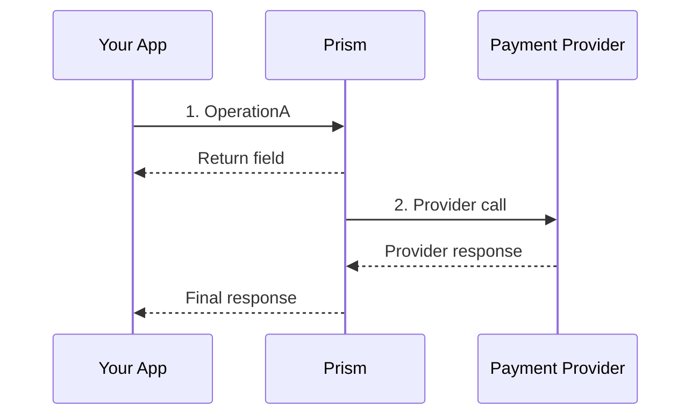
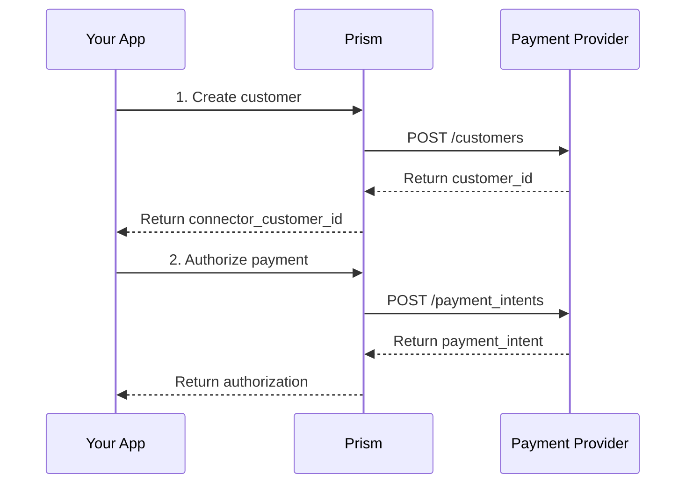

# Documentation Rules

These rules govern how API reference documentation is generated and validated. They ensure consistent, complete, and developer-friendly documentation.

## Documentation Patterns

| Pattern | Description | Example Path |
|---------|-------------|--------------|
| [API Reference Overview](#api-reference-overview-rules) | Service-level index describing all operations | `services/payment-service/README.md` |
| [API Reference Operation](#api-reference-operation-rules) | Individual RPC documentation | `services/payment-service/authorize.md` |
| [Domain Types Overview](#domain-types-overview-rules) | Message/enum index for a domain | `messages/payment/README.md` |
| [Domain Types Reference](#domain-types-reference-rules) | Individual message/enum documentation | `messages/payment/money.md` |
| [Connectors Overview](#connectors-overview-rules) | Connector integration status matrix | `connectors/README.md` |

---

# Common Rules

Rules that apply to ALL documentation patterns.

## C1: Front Matter Format

**Requirement:** All metadata must be wrapped in HTML comments.

**Format:**
```markdown
<!--
---
title: {page_title}
description: {one_sentence_description}
last_updated: {YYYY-MM-DD}
generated_from: {source_file_path}
auto_generated: {true|false}
reviewed_by: {reviewer_name|''}
reviewed_at: {YYYY-MM-DD|''}
approved: {true|false}
---
-->
```

**Fields:**
- `title`: Human-readable page title
- `description`: One-sentence summary
- `last_updated`: ISO date of last modification
- `generated_from`: Source proto/file path
- `auto_generated`: Whether created by LLM/tool
- `reviewed_by`: Reviewer identifier
- `reviewed_at`: ISO date of review
- `approved`: Whether approved for publication

**Rationale:** HTML comment wrapping prevents front matter from rendering in GitBook while preserving metadata for tooling.

---

## C2: File Naming Conventions

**Requirements:**
1. All lowercase
2. Use hyphens for word separation
3. Match proto names (converted to kebab-case)

**Pattern-Specific Formats:**

| Pattern | Format | Example |
|---------|--------|---------|
| API Overview | `services/{service-name}/README.md` | `services/payment-service/README.md` |
| API Operation | `services/{service-name}/{rpc-name}.md` | `services/payment-service/authorize.md` |
| Domain Overview | `messages/{domain}/README.md` | `messages/payment/README.md` |
| Domain Type | `messages/{domain}/{type-name}.md` | `messages/payment/money.md` |

---

## C3: Product Naming

**Requirement:** Always refer to the product as "Prism". Never use "UCS", "Universal Prism", or other abbreviations.

**Correct:**
- "The Prism API provides..."
- "This Domain Schema defines types used across Prism..."
- "To integrate with Prism..."

**Incorrect:**
- "The UCS API provides..."
- "This Domain Schema defines types used across UCS..."
- "To integrate with Universal Prism..."

**Rationale:** Consistent product naming builds brand recognition and avoids confusion for developers reading the documentation.

---

## C4: Heading Structure

**Requirement:** Use consistent heading levels for each pattern type.

**General Rules:**
- H1 (`#`) - Page title only
- H2 (`##`) - Major sections
- H3 (`###`) - Subsections
- H4 (`####`) - Detailed breakdowns

---

## C4: Code Examples

### C4.1: Authentication Format

**Requirement:** Use connector-specific authentication headers.

**Format:**
```bash
grpcurl -H "x-connector: {connector}" \
  -H "x-connector-config: {\"config\":{\"{Connector}\":{\"api_key\":\"$API_KEY\"}}}" \
```

**Stripe Example:**
```bash
grpcurl -H "x-connector: stripe" \
  -H "x-connector-config: {\"config\":{\"Stripe\":{\"api_key\":\"$STRIPE_API_KEY\"}}}" \
```

### C4.2: Service/Operation URL Format

**Requirement:** Use `types.{ServiceName}/{OperationName}` format for the gRPC method URL.

**Format:**
```bash
grpcurl ... localhost:8080 types.{ServiceName}/{OperationName}
```

**Examples:**
```bash
# PaymentService operations
types.PaymentService/Authorize
types.PaymentService/Capture
types.PaymentService/Get
types.PaymentService/Void

# RecurringPaymentService operations
types.RecurringPaymentService/Charge
types.RecurringPaymentService/Revoke

# PaymentMethodService operations
types.PaymentMethodService/Tokenize

# EventService operations
types.EventService/HandleEvent
```

**Rationale:** The proto package is declared as `package types` in the service definitions, so the fully-qualified method name uses the `types` prefix. This ensures consistency with the generated proto code and gRPC reflection.

### C4.3: Test Data

**Card Numbers:**
- Success: `4242424242424242` (Visa)
- Decline: `4000000000000002` (Generic decline)
- 3DS: `4000000000003220` (3DS2 frictionless)

**Other Fields:**
- Future dates for expiry: `12`, `2027`
- Realistic minor amounts: `1000` (=$10.00)
- ISO currency codes: `USD`, `EUR`

**Endpoint:** Use `localhost:8080` for examples.

---

# API Reference Overview Rules

For service-level README files that index all operations.

## O1: Required Sections

1. **## Overview** - Service purpose and business value
2. **## Operations** - Table of all RPCs with links
3. **## Common Patterns** - Typical usage flows
4. **## Next Steps** - Links to related services

## O2: Operations Table Format

```markdown
| Operation | Description | Use When |
|-----------|-------------|----------|
| [Authorize](./authorize.md) | Reserve funds without capturing | Two-step payment flow |
| [Capture](./capture.md) | Finalize and transfer funds | Order shipped/service delivered |
```

**Columns:**
- `Operation`: Linked operation name
- `Description`: One-line purpose
- `Use When`: Scenario guidance

## O3: Common Patterns Section

**Purpose:** Show how operations combine into business workflows.

**Format:**
```markdown
## Common Patterns

### Pattern Name
Description of the business scenario.


```

**Requirements:**
- Include 3 use cases showing sequence of operations
- Use mermaid sequence diagrams showing flow of operations
- **Participants must be:** `App` (Your App), `CS` (Prism), `PP` (Payment Provider)
- Do NOT include request/response examples
- Always hyperlink operation names to their API reference

---

## O4: Operations Description Source

**Requirement:** Description notes must come from proto file comments.

**Process:**
1. Extract the leading comment above each RPC definition in the proto file
2. Use that comment as the Description in the Operations table
3. Keep descriptions concise (one line)

**Example:**
```protobuf
// Authorize a payment amount on a payment method. This reserves funds
// without capturing them, essential for verifying availability before finalizing.
rpc Authorize(...) returns (...);
```

Becomes:
```markdown
| [Authorize](./authorize.md) | Authorize a payment amount on a payment method. This reserves funds without capturing them... |
```

---

## O5: Operation References

**Requirement:** Always hyperlink operation names to their API reference.

**Format:**
- In Operations table: `[OperationName](./operation-name.md)`
- In Common Patterns: `[OperationName](./operation-name.md)`
- In text: Use backticks with link: [`OperationName`](./operation-name.md)

---

# API Reference Operation Rules

For individual RPC documentation (already established).

## OP1: Required Sections (in order)

1. `# {RPC Name} RPC` - H1 with RPC name
2. `## Overview` - Business use case
3. `## Purpose` - Why use this RPC
4. `## Request Fields` - Complete request table
5. `## Response Fields` - Complete response table
6. `## Example` - grpcurl + response
7. `## Next Steps` - Related operations

## OP2: Overview Section

**Structure:**
1. One-sentence RPC purpose
2. 2-3 paragraphs on business value
3. Target personas: e-commerce, marketplaces, SaaS

## OP3: Purpose Section

**Structure:**
1. Heading: "Why use {rpc_name} instead of alternatives?"
2. Scenarios table: **Scenario** | **Developer Implementation**
3. Key outcomes bullet list

## OP4: Request Fields Table

**Format:**
```markdown
| Field | Type | Required | Description |
|-------|------|----------|-------------|
| `field_name` | {proto_type} | Yes/No | {description} |
```

**Rules:**
- Include EVERY field from proto (no omissions)
- Use backticks around field names
- Match proto types exactly
- Include enum values in description: "Values: MANUAL, AUTOMATIC"

## OP5: Response Fields Table

**Format:**
```markdown
| Field | Type | Description |
|-------|------|-------------|
| `field_name` | {proto_type} | {description} |
```

## OP6: Example Section

**Structure:**
- `### Request (grpcurl)` - Complete command
- `### Response` - JSON response

---

# Domain Types Overview Rules

For domain-level README files indexing messages and enums.

## DO1: Required Sections

1. **## Overview** - Domain purpose and scope
2. **## Messages** - Table of message types
3. **## Enums** - Table of enum types
4. **## Common Fields** - Fields that appear across types
5. **## Relationships** - How types connect

## DO2: Messages Table Format

```markdown
| Domain Type | Description | Example | Related Types |
|-------------|-------------|---------|---------------|
| `Money` | Monetary amount with currency. Amounts are in minor units (e.g., 1000 = $10.00). | `{"minor_amount": 1000, "currency": "USD"}` | `Currency`, `PaymentAddress` |
| `Customer` | Customer information including name, email, ID. | `{"id": "cus_123", "name": "John Doe", "email": "john@example.com", "phone": "+1-555-0123"}` | `Address`, `PaymentMethod` |
```

## DO6: Exclude Service Request/Response Types

**Requirement:** Do NOT include service request/response message types in the Domain Types Index.

**Rationale:** Service request/response types (e.g., `PaymentServiceAuthorizeRequest`, `RefundResponse`) are documented in the API Reference section for each service. The Domain Schema should only contain:
- Reusable data structures (Money, Address, Customer, etc.)
- Enums (PaymentStatus, Currency, Connector, etc.)
- Types that appear as fields in multiple services

**Excluded Types:**
- `PaymentService*Request` / `PaymentService*Response`
- `RefundService*Request` / `RefundService*Response`
- `DisputeService*Request` / `DisputeService*Response`
- `RecurringPaymentService*Request` / `RecurringPaymentService*Response`
- `CustomerService*Request` / `CustomerService*Response`
- `EventService*Request` / `EventService*Response`
- `MerchantAuthenticationService*Request` / `MerchantAuthenticationService*Response`
- `PaymentMethodAuthenticationService*Request` / `PaymentMethodAuthenticationService*Response`
- `PaymentMethodService*Request` / `PaymentMethodService*Response`

**Included Types:**
- Core types: `Money`, `Identifier`, `Customer`, `Address`, `ErrorInfo`
- Payment methods: `PaymentMethod`, `CardDetails`, `AppleWallet`, `GooglePay`
- Enums: `PaymentStatus`, `Currency`, `Connector`, `CaptureMethod`
- Authentication: `AuthenticationData`, `BrowserInformation`
- Mandates: `MandateReference`, `SetupMandateDetails`
- Webhooks: `WebhookEventType`, `WebhookSecrets`
- Connector responses: `ConnectorResponseData`, `CardConnectorResponse`

## DO3: Enums Table Format

```markdown
| Domain Type | Values | Description |
|-------------|--------|-------------|
| `PaymentStatus` | `STARTED`, `AUTHORIZED`, `CAPTURED`, `FAILED`, `VOIDED` | Complete payment lifecycle states. `AUTHORIZED` = funds held, `CAPTURED` = funds transferred. |
| `CaptureMethod` | `MANUAL`, `AUTOMATIC` | When to capture funds. `AUTOMATIC` = immediate capture, `MANUAL` = merchant-initiated. |
```

## DO4: Example Column Format

**Requirement:** Show a JSON sample demonstrating typical values for the type.

**Rules:**
- Use realistic example values
- For messages: Show a complete JSON object with all key fields
- For enums: List the most commonly used values (first 3-5)
- Keep examples concise (single line if possible)

## DO5: Related Types Column Format

**Requirement:** List all related domain types. Use plain text without hyperlinks.

**Rules:**
- Include types that are commonly used together
- Reference types that use this type as a field
- Reference parent/containing types (e.g., `PaymentMethod` for `CardDetails`)
- Reference child/component types
- Use plain text: `TypeName` (not hyperlinks)
- **Exception:** Do NOT hyperlink enum types - they have no separate documentation pages

---

## DO7: Enum Documentation Format

**Requirement:** Enums MUST NOT have hyperlinks to separate markdown files. Enums are documented inline within the Domain Schema index.

**Format:**
```markdown
| Domain Type | Values | Description |
|-------------|--------|-------------|
| `PaymentStatus` | `STARTED`, `AUTHORIZED`, `CAPTURED` | Description of what this enum represents |
```

**Rules:**
- Use plain text with backticks: `EnumName` (NOT `[EnumName](./enum-name.md)`)
- Include a clear description column explaining the purpose
- Document commonly used values in the Values column
- Explain state transitions or business logic in the Description column

---

## DO8: Example Column Requirements

**Requirement:** Examples must be complete, realistic, and understandable.

**Rules:**
- Show complete JSON objects with all key fields
- Use realistic test data (e.g., `4242424242424242` for test cards)
- Include context where helpful (minor units explanation, field purpose)
- For complex types, show nested structures with sample values
- Examples should be copy-paste friendly for developers

**Good Example:**
```json
{"card_number": "4242424242424242", "expiry_month": "12", "expiry_year": "2027", "card_holder_name": "John Doe"}
```

**Poor Example:**
```json
{"card": {...}}
```

---

# Domain Types Reference Rules

For individual message and enum documentation.

## DT1: Message Documentation

**Required Sections:**
1. `# {MessageName}` - H1 with message name
2. `## Overview` - Purpose and usage context
3. `## Fields` - Complete field table
4. `## Usage Examples` - JSON examples
5. `## Related Types` - Linked related messages

### DT1.1: Fields Table

```markdown
| Field | Type | Required | Description |
|-------|------|----------|-------------|
| `minor_amount` | int64 | Yes | Amount in smallest currency unit (e.g., cents) |
| `currency` | string | Yes | ISO 4217 currency code (e.g., "USD") |
```

### DT1.2: JSON Example

```markdown
## Usage Examples

```json
{
  "minor_amount": 1000,
  "currency": "USD"
}
```
```

## DT2: Enum Documentation

**Required Sections:**
1. `# {EnumName}` - H1 with enum name
2. `## Overview` - Purpose and when to use
3. `## Values` - Table of enum values
4. `## State Transitions` - (if applicable) Valid transitions
5. `## Usage` - Which operations use this enum

### DT2.1: Values Table

```markdown
| Value | Numeric | Description |
|-------|---------|-------------|
| `STARTED` | 0 | Payment initiated, not yet processed |
| `AUTHORIZED` | 1 | Funds reserved, awaiting capture |
| `CAPTURED` | 2 | Funds transferred successfully |
| `FAILED` | 3 | Payment processing failed |
| `VOIDED` | 4 | Authorization cancelled before capture |
```

### DT2.2: State Transitions

```markdown
## State Transitions

```
STARTED → AUTHORIZED → CAPTURED
    ↓          ↓
 FAILED     VOIDED
```

**Valid Transitions:**
- `AUTHORIZED` → `CAPTURED` (via Capture RPC)
- `AUTHORIZED` → `VOIDED` (via Void RPC)
- Any state → terminal (no further transitions)
```

---

# GitBook Maintenance Rules

Rules for keeping GitBook configuration in sync with documentation changes.

## G1: Update gitbook.yml on New Sections

**Requirement:** When adding new top-level documentation directories, update `gitbook.yml` if they should be excluded from GitBook.

**Process:**
1. Determine if the new directory contains internal-only content (plans, rules, specs)
2. If internal-only, add to `gitbook.yml` ignore list:
   ```yaml
   ignore:
     - existing-dir/**
     - new-internal-dir/**  # Add new exclusion
   ```

**Rationale:** Internal documentation (planning docs, rules, specs) should not appear in public GitBook.

## G2: Update SUMMARY.md on New Pages

**Requirement:** Every new markdown file must be added to `SUMMARY.md` in the appropriate section.

**Process:**
1. Identify the logical section for the new page
2. Add the entry following the existing format: `- [Title](path/to/file.md)`
3. Place it in logical order within the section (not alphabetical)
4. For new services, create a subsection with the service name

**Example - Adding a New Service:**
```markdown
## API Reference
- [Overview](api-reference/README.md)
- New Service Name                          # New subsection
  - [Overview](api-reference/services/new-service/README.md)
  - [Operation](api-reference/services/new-service/operation.md)
```

**Example - Adding to Existing Service:**
```markdown
- Payment Service
  - [Overview](api-reference/services/payment-service/README.md)
  - [Authorize](api-reference/services/payment-service/authorize.md)
  - [New Operation](api-reference/services/payment-service/new-operation.md)  # Add here
```

## G3: SUMMARY.md Section Ordering

**Requirement:** Sections in SUMMARY.md should follow this priority order:

1. **Getting Started** - First impression for new users
2. **SDKs** - Implementation guides by language
3. **Connectors** - Payment provider-specific guides
4. **Architecture** - System design and concepts
5. **API Reference** - Detailed API documentation (last, for reference)

**Rationale:** Documentation should progress from introduction → implementation → reference.

## G4: Verify Before Commit

**Requirement:** Before committing documentation changes, verify:

1. All new `.md` files are listed in `SUMMARY.md`
2. No broken links in `SUMMARY.md` entries
3. `gitbook.yml` excludes internal-only content
4. Section ordering follows G3 priority

**Checklist:**
```markdown
- [ ] New files added to SUMMARY.md
- [ ] Internal files excluded in gitbook.yml (if applicable)
- [ ] Links in SUMMARY.md are valid
- [ ] Section ordering follows priority (Getting Started → SDKs → Connectors → Architecture → API Reference)
```

---

## O6: Cross-Service Pattern Documentation

**Requirement:** When documenting patterns that involve multiple services, fully explain all steps within the pattern. Do NOT ask readers to "see OtherService for details" or "refer to X documentation" within the flow explanation.

**Why:** Readers should understand the complete data flow without jumping between documents. Each pattern should be self-contained.

**Correct:**
```markdown
### Subscription Flow



**Flow explanation:**
1. **Create customer** - Store customer details at the processor
2. **Authorize payment** - Reserve funds on customer's payment method
```

**Incorrect:**
```markdown
1. Create customer (see CustomerService for details)
2. Authorize payment (refer to PaymentService.Authorize)
```

---

# Connectors Overview Rules

For connector integration status documentation that tracks which operations are implemented per connector.

## CO1: Status Definitions

Use standardized status labels with consistent badge formatting:

| Status | Badge | Description |
|--------|-------|-------------|
| Tested | `` | Code is integrated AND tests are available in `/tests` folder |
| Integrated | `` | Code and transformers are available in `/connectors` folder |
| Not Integrated | `` | No code or mapping available |

## CO2: Matrix Structure

Organize tables by service type:

**PaymentService Matrix Columns:**
- Connector name (first column)
- Authorize, Capture, Void, PSync (Get)
- SetupMandate, CreateOrder, CreateCustomer, PaymentToken
- IncrementalAuthorization, VoidPostCapture, RepeatPayment

**RefundService Matrix Columns:**
- Connector name (first column)
- Refund, RSync (Refund Sync)

**DisputeService Matrix Columns:**
- Connector name (first column)
- AcceptDispute, DefendDispute, SubmitEvidence

## CO3: Table Format

Use centered alignment for status columns and left alignment for connector names:

```markdown
| Connector | Authorize | Capture | Void | PSync |
|-----------|:---------:|:-------:|:----:|:-----:|
| **Stripe** |  |  |  |  |
```

## CO4: Connector Details Section

Include a details section for each connector with:

1. **Location** - Path to the connector implementation file
2. **Transformers** - Path to the transformers subdirectory
3. **Tests** - Path to test file (if available)
4. **Supported Operations** - Comma-separated list of implemented operations

**Format:**
```markdown
### Stripe
- **Location**: `crates/integrations/connector-integration/src/connectors/stripe.rs`
- **Transformers**: `crates/integrations/connector-integration/src/connectors/stripe/transformers.rs`
- **Tests**: `crates/grpc-server/grpc-server/tests/stripe_payment_flows_test.rs`
- **Supported Operations**: Authorize, Capture, Void, PSync, Refund, RSync, SetupMandate
```

## CO5: Adding New Connectors

When adding a new connector:

1. Add the connector row to each relevant service table
2. Mark operations as integrated using the badge format
3. When tests are added, update status from Integrated to Tested
4. Add connector details section at the bottom of the document

## CO6: Adding New Operations

When adding a new operation:

1. Add the operation column to the relevant service table
2. Mark the status for each connector that implements it
3. Update the status legend if introducing a new status type

---

# Appendix: Common Enums Reference

**PaymentStatus:** STARTED, AUTHORIZED, CAPTURED, FAILED, VOIDED, CHARGED

**CaptureMethod:** MANUAL, AUTOMATIC

**AuthenticationType:** NO_THREE_DS, THREE_DS

**FutureUsage:** ON_SESSION, OFF_SESSION

**RefundStatus:** PENDING, SUCCEEDED, FAILED
