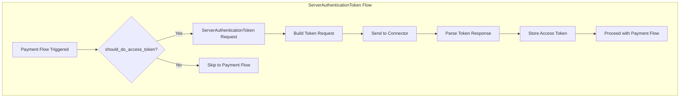

# ServerAuthenticationToken Flow Implementation Patterns

> **Auth mechanism: C — MERCHANT / CREDENTIAL AUTHENTICATION. This is NOT 3DS.**
>
> UCS has three separate authentication mechanisms. Conflating them is the single largest
> codegen risk in this corpus:
>
> | # | Mechanism | Flow markers | `resource_common_data` | gRPC service |
> |---|---|---|---|---|
> | A | Standalone 3DS trio | `PreAuthenticate` / `Authenticate` / `PostAuthenticate` | `PaymentFlowData` | `PaymentMethodAuthenticationService` |
> | B | In-payment 3DS | none — folded into `Authorize` | `PaymentFlowData` | `PaymentService.Authorize` |
> | **C** | **Merchant / credential auth — THIS FILE** | `ServerAuthenticationToken` / `ServerSessionAuthenticationToken` / `ClientAuthenticationToken` | **`MerchantAuthenticationFlowData`** | `MerchantAuthenticationService` |
>
> Every mechanism-C flow binds **`MerchantAuthenticationFlowData`**, never `PaymentFlowData`.
> `MerchantAuthenticationFlowData` lives in `crates/types-traits/domain_types/src/merchant_authentication_flow_data.rs`
> and its own doc-comment says why: *"This type deliberately omits payment-specific fields
> (`payment_id`, `attempt_id`, `status`, `payment_method`, `address`, `amount`, etc.) because
> merchant-authentication flows have no payment identity."*
>
> Verify before copying anything below:
> ```bash
> rg -n "pub trait (ServerAuthentication|ServerSessionAuthentication|ClientAuthentication):" -A 9 \
>    crates/types-traits/interfaces/src/connector_types.rs
> ```
>
> External 3DS providers (Netcetera, 3dsecure.io, GPayments, Cardinal, CTP) run entirely inside the
> Hyperswitch router and never reach UCS. Do not generate UCS flows for that class.
> `crates/integrations/connector-integration/src/authenticator_connectors/plaid.rs` is bank-account
> linking, not 3DS — it is a mechanism-C connector (see `pattern_client_authentication_token.md`).

## Overview

The `ServerAuthenticationToken` flow is a crucial authentication flow in the Grace-UCS connector ecosystem. It handles OAuth 2.0 token acquisition for connectors that require bearer tokens to authenticate API requests. This pattern is typically invoked before payment flows when `should_do_access_token()` returns `true`.

### When to Use ServerAuthenticationToken

- **OAuth-based connectors**: When the connector API uses OAuth 2.0 for authentication
- **Token expiration**: When stored access tokens have expired and need refresh
- **First-time authentication**: When no valid access token exists for the connector

## Architecture


```mermaid
flowchart TB
    subgraph "ServerAuthenticationToken Flow"
        A[Payment Flow Triggered] --> B{should_do_access_token?}
        B -->|Yes| C[ServerAuthenticationToken Request]
        B -->|No| D[Skip to Payment Flow]
        C --> E[Build Token Request]
        E --> F[Send to Connector]
        F --> G[Parse Token Response]
        G --> H[Store Access Token]
        H --> I[Proceed with Payment Flow]
    end
```

## Core Components

### 1. Flow Definition

The flow marker is a plain unit struct — `pub struct ServerAuthenticationToken;` in
`crates/types-traits/domain_types/src/connector_flow.rs`, alongside its `FlowName::ServerAuthenticationToken`
enum entry in the same file. It carries no associated types.

> **DELETED FALSEHOOD (was here through v1.2.0).** Earlier revisions of this file taught:
> ```rust
> impl ConnectorFlow for ServerAuthenticationToken {   // ← FICTION
>     type Request = ServerAuthenticationTokenRequestData;
>     type Response = ServerAuthenticationTokenResponseData;
> }
> ```
> **There is no `ConnectorFlow` trait anywhere in the tree.** Verify:
> `rg -n "trait ConnectorFlow" crates/` → zero hits. Flow markers are bare unit structs; they
> declare no `type Request` / `type Response`. Any generated code following that snippet fails
> to compile with E0405 (cannot find trait `ConnectorFlow`).

The real binding is a **`ConnectorIntegrationV2` supertrait**: the four type parameters
`<Flow, ResourceCommonData, FlowSpecificRequest, FlowSpecificResponse>` are pinned by the marker
trait in `crates/types-traits/interfaces/src/connector_types.rs`:

```rust
// crates/types-traits/interfaces/src/connector_types.rs — `pub trait ServerAuthentication`
pub trait ServerAuthentication:
    ConnectorIntegrationV2<
    connector_flow::ServerAuthenticationToken,
    MerchantAuthenticationFlowData,        // NOT PaymentFlowData
    ServerAuthenticationTokenRequestData,
    ServerAuthenticationTokenResponseData,
>
{
}
```

`ServerAuthentication` is a supertrait of `ConnectorServiceTrait`, `FrmServiceTrait` **and**
`PayoutServiceTrait` (all three in the same file), so every connector in all three registries must
provide at least the empty impl.

### 2. Data Types

#### Request Data

`ServerAuthenticationTokenRequestData` is **not** an empty struct — it carries one field. Verbatim
from `crates/types-traits/domain_types/src/connector_types.rs`, `pub struct ServerAuthenticationTokenRequestData`:

```rust
#[derive(Debug, Clone)]
pub struct ServerAuthenticationTokenRequestData {
    pub grant_type: String,
}
```

Credentials themselves are NOT on the request — they come from `req.connector_config: ConnectorSpecificConfig`
(`crates/types-traits/domain_types/src/router_data_v2.rs`, `pub struct RouterDataV2`).

#### Response Data

Verbatim from `crates/types-traits/domain_types/src/connector_types.rs`,
`pub struct ServerAuthenticationTokenResponseData` — field order matters when you write a struct
literal without `..Default::default()`:

```rust
#[derive(Clone, Debug, Default, Serialize, Deserialize)]
pub struct ServerAuthenticationTokenResponseData {
    pub access_token: Secret<String>,
    pub token_type: Option<String>,   // e.g. "Bearer"
    pub expires_in: Option<i64>,      // seconds until expiry
}
```

#### Resource Common Data

`MerchantAuthenticationFlowData` — `crates/types-traits/domain_types/src/merchant_authentication_flow_data.rs`.
Its fields are: `merchant_id`, `connectors`, `connector_request_reference_id`, `test_mode`,
`return_url`, `connector_feature_data`, `order_details`, `merchant_request_id`, plus the five
observability fields (`raw_connector_response`, `typed_connector_response`, `raw_connector_request`,
`typed_connector_request`, `connector_response_headers`). It has exactly one inherent method,
`get_return_url()`.

There is **no** `payment_id`, `attempt_id`, `status`, `payment_method`, `address`, `amount`,
`access_token` or `session_token` on it. Code that reaches for
`req.resource_common_data.status` or `req.resource_common_data.access_token` inside a
`ServerAuthenticationToken` impl does not compile (E0609).

Because there is no `connectors.<name>.base_url` accessor shaped for `PaymentFlowData`, connectors
add a second URL helper alongside the payment one, e.g. in `crates/integrations/connector-integration/src/connectors/volt.rs`:

```rust
pub fn connector_base_url_merchant_auth<F, Req, Res>(
    &self,
    req: &RouterDataV2<F, MerchantAuthenticationFlowData, Req, Res>,
) -> String {
    req.resource_common_data.connectors.volt.base_url.to_string()
}
```

### 3. Trait Implementation

Connectors implement the `ServerAuthentication` marker trait to satisfy the service-trait bound:

```rust
impl<T: PaymentMethodDataTypes + Debug + Sync + Send + 'static + Serialize>
    connector_types::ServerAuthentication for ConnectorName<T>
{
}
```

Additionally, connectors implement `ValidationTrait` to indicate when an access token is needed.
The real signature takes an **`Option<PaymentMethod>`** — see `fn should_do_access_token` on
`pub trait ValidationTrait` in `crates/types-traits/interfaces/src/connector_types.rs`:

```rust
impl<T: PaymentMethodDataTypes + Debug + Sync + Send + 'static + Serialize>
    connector_types::ValidationTrait for ConnectorName<T>
{
    fn should_do_access_token(&self, _payment_method: Option<common_enums::PaymentMethod>) -> bool {
        true  // Return true if an OAuth bearer must be minted before the payment flow
    }
}
```

## Implementation Patterns

### Pattern 1: OAuth 2.0 Client Credentials Grant (Full Implementation)

Used by connectors like **Volt**, **Airwallex**, **Getnet**, **Jpmorgan**, **Truelayer**, **Trustpay**.

#### Request Structure

```rust
#[derive(Debug, Clone, Serialize, PartialEq)]
pub struct ConnectorAuthUpdateRequest {
    grant_type: String,           // "client_credentials" or "password"
    client_id: Secret<String>,
    client_secret: Secret<String>,
    // Optional fields depending on connector
    username: Secret<String>,     // For password grant
    password: Secret<String>,     // For password grant
    scope: Option<String>,        // OAuth scopes
}
```

#### Response Structure

```rust
#[derive(Debug, Clone, Deserialize, Serialize)]
pub struct ConnectorAuthUpdateResponse {
    pub access_token: Secret<String>,
    pub token_type: String,       // "Bearer"
    pub expires_in: i64,          // Seconds until expiration
    pub scope: Option<String>,    // Granted scopes (optional)
}
```

#### Example: Volt Implementation

**Step 1: Define Auth Type**
```rust
#[derive(Debug, Clone)]
pub struct VoltAuthType {
    pub client_id: Secret<String>,
    pub client_secret: Secret<String>,
    pub username: Secret<String>,
    pub password: Secret<String>,
}

// Auth is read from `ConnectorSpecificConfig`, NOT from a `connector_auth_type` field —
// `RouterDataV2` lost `connector_auth_type` on 2026-03-14 (a7a696c3a); the field is now
// `req.connector_config: ConnectorSpecificConfig` (`pub struct RouterDataV2` in
// crates/types-traits/domain_types/src/router_data_v2.rs).
// `ConnectorSpecificConfig` has ONE struct variant PER CONNECTOR (`pub enum ConnectorSpecificConfig`
// in crates/types-traits/domain_types/src/router_data.rs),
// not generic HeaderKey/BodyKey/SignatureKey variants — add your connector's variant there and
// match on it. Exemplar: `impl TryFrom<&ConnectorSpecificConfig> for VoltAuthType` in
// crates/integrations/connector-integration/src/connectors/volt/transformers.rs.
impl TryFrom<&ConnectorSpecificConfig> for VoltAuthType {
    type Error = error_stack::Report<errors::IntegrationError>;

    fn try_from(auth_type: &ConnectorSpecificConfig) -> Result<Self, Self::Error> {
        match auth_type {
            ConnectorSpecificConfig::Volt {
                username,
                password,
                client_id,
                client_secret,
                ..
            } => Ok(Self {
                username: username.to_owned(),
                password: password.to_owned(),
                client_id: client_id.to_owned(),
                client_secret: client_secret.to_owned(),
            }),
            _ => Err(errors::IntegrationError::FailedToObtainAuthType {
                context: Default::default(),
            }
            .into()),
        }
    }
}
```

**Step 2: Define Request Type**
```rust
#[derive(Debug, Clone, Serialize, PartialEq)]
pub struct VoltAuthUpdateRequest {
    grant_type: String,
    client_id: Secret<String>,
    client_secret: Secret<String>,
    username: Secret<String>,
    password: Secret<String>,
}

impl TryFrom<&ConnectorSpecificConfig> for VoltAuthUpdateRequest {
    type Error = error_stack::Report<errors::IntegrationError>;

    fn try_from(auth_type: &ConnectorSpecificConfig) -> Result<Self, Self::Error> {
        let auth = VoltAuthType::try_from(auth_type)?;
        Ok(Self {
            grant_type: "password".to_string(),
            username: auth.username,
            password: auth.password,
            client_id: auth.client_id,
            client_secret: auth.client_secret,
        })
    }
}

// Router data conversion
impl<T: PaymentMethodDataTypes + std::fmt::Debug + Sync + Send + 'static + Serialize>
    TryFrom<
        VoltRouterData<
            RouterDataV2<
                ServerAuthenticationToken,
                MerchantAuthenticationFlowData,
                ServerAuthenticationTokenRequestData,
                ServerAuthenticationTokenResponseData,
            >,
            T,
        >,
    > for VoltAuthUpdateRequest
{
    type Error = error_stack::Report<errors::IntegrationError>;

    fn try_from(
        item: VoltRouterData<...>,
    ) -> Result<Self, Self::Error> {
        Self::try_from(&item.router_data.connector_config)
    }
}
```

**Step 3: Define Response Type**
```rust
#[derive(Debug, Clone, Deserialize, Serialize)]
pub struct VoltAuthUpdateResponse {
    pub access_token: Secret<String>,
    pub token_type: String,
    pub expires_in: i64,
}

// Response conversion to domain type
impl<F, T> TryFrom<ResponseRouterData<VoltAuthUpdateResponse, Self>>
    for RouterDataV2<F, MerchantAuthenticationFlowData, T, ServerAuthenticationTokenResponseData>
{
    type Error = error_stack::Report<errors::ConnectorError>;

    fn try_from(
        item: ResponseRouterData<VoltAuthUpdateResponse, Self>,
    ) -> Result<Self, Self::Error> {
        Ok(Self {
            response: Ok(ServerAuthenticationTokenResponseData {
                access_token: item.response.access_token,
                expires_in: Some(item.response.expires_in),
                token_type: Some(item.response.token_type),
            }),
            ..item.router_data
        })
    }
}
```

**Step 4: Register in Macro**
```rust
macros::create_all_prerequisites!(
    connector_name: Volt,
    generic_type: T,
    api: [
        (
            flow: ServerAuthenticationToken,
            request_body: VoltAuthUpdateRequest,
            response_body: VoltAuthUpdateResponse,
            router_data: RouterDataV2<ServerAuthenticationToken, MerchantAuthenticationFlowData, ServerAuthenticationTokenRequestData, ServerAuthenticationTokenResponseData>,
        ),
        // ... other flows
    ]
);
```

**Step 5: Declare the flow integration**

```rust
macros::macro_connector_implementation!(
    connector_default_implementations: [get_content_type],
    connector: Volt,
    curl_request: Json(VoltAuthUpdateRequest),
    curl_response: VoltAuthUpdateResponse,
    flow_name: ServerAuthenticationToken,
    resource_common_data: MerchantAuthenticationFlowData,   // ← mechanism C, not PaymentFlowData
    flow_request: ServerAuthenticationTokenRequestData,
    flow_response: ServerAuthenticationTokenResponseData,
    http_method: Post,
    generic_type: T,
    [PaymentMethodDataTypes + Debug + Sync + Send + 'static + Serialize],
    other_functions: { /* get_headers, get_url — see "URL Patterns" below */ }
);
```

### Where the minted token actually goes

The `ServerAuthenticationToken` impl does **not** write the token onto its own
`resource_common_data` — `MerchantAuthenticationFlowData` has no `access_token` field. The carrier
chain is external to the connector:

1. The connector returns `Ok(ServerAuthenticationTokenResponseData { access_token, token_type, expires_in })`.
2. That becomes gRPC `MerchantAuthenticationServiceCreateServerAuthenticationTokenResponse`
   (`crates/types-traits/grpc-api-types/proto/services.proto`, rpc `CreateServerAuthenticationToken`).
3. `crates/internal/composite-service/src/utils.rs` — `pub fn get_access_token` and
   `pub fn access_token_from_create_server_authentication_token_response` — fold it back onto the
   next payment request (request value wins; the freshly minted token is the fallback).
4. `PaymentFlowData.access_token: Option<ServerAuthenticationTokenResponseData>`
   (`crates/types-traits/domain_types/src/connector_types.rs`, `pub struct PaymentFlowData`) is what
   the *payment* flows then read, via `get_access_token_data()` / `get_access_token_optional()`.

So the Authorize transformer reads `PaymentFlowData.access_token`; the `ServerAuthenticationToken`
transformer never touches it.

### Pattern 2: Empty Request Body (Airwallex)

Some connectors like **Airwallex** require an empty request body for token generation:

```rust
// Empty request body for ServerAuthenticationToken - Airwallex requires empty JSON object {}
#[derive(Debug, Serialize)]
pub struct AirwallexAccessTokenRequest {
    // Empty struct that serializes to {} - Airwallex API requirement
}

// Auth is passed as two custom headers, NOT Basic auth — see the get_headers override in
// crates/integrations/connector-integration/src/connectors/airwallex.rs
```

**Key Characteristics:**
- Reads `ConnectorSpecificConfig::Airwallex { api_key, client_id, base_url }` (`crates/types-traits/domain_types/src/router_data.rs`, `pub enum ConnectorSpecificConfig`, variant `Airwallex`)
- **CORRECTED:** earlier revisions of this file claimed "Basic base64(client_id:client_secret)".
  Airwallex has no `client_secret` on its `ConnectorSpecificConfig` variant and sends **no**
  `Authorization` header at all. Its `get_headers` emits three headers verbatim:
  `Content-Type: application/json`, `x-api-key: {api_key}`, `x-client-id: {client_id}`.
- URL is built inline off `req.resource_common_data.connectors.airwallex.base_url` +
  `/authentication/login` (Airwallex does not declare a `connector_base_url_merchant_auth` helper).
- Empty JSON body `{}` in request (`curl_request: Json(AirwallexAccessTokenRequest)`)
- The wire response is `pub struct AirwallexAccessTokenResponse { token: Secret<String>, expires_at:
  time::PrimitiveDateTime }` — an ISO-8601 instant, not an `expires_in` duration. Read it before
  copying any generic OAuth response shape.

### Pattern 3: OAuth with Base64 Encoding (PayPal)

**PayPal** uses a specific authentication approach with Base64 encoding:

```rust
pub const BASE64_ENGINE: base64::engine::GeneralPurpose = base64::engine::general_purpose::STANDARD;

// Auth header generation
fn auth_headers(
    client_id: &Secret<String>,
    client_secret: &Secret<String>,
) -> CustomResult<String, IntegrationError> {
    let auth = format!(
        "{}:{}",
        client_id.expose(),
        client_secret.expose()
    );
    Ok(BASE64_ENGINE.encode(auth))
}

// Request uses form-urlencoded body (`curl_request: FormUrlEncoded(PaypalAuthUpdateRequest)`).
// Verbatim from crates/integrations/connector-integration/src/connectors/paypal/transformers.rs,
// `pub struct PaypalAuthUpdateRequest` — it carries the credentials in the BODY as well:
#[derive(Debug, Serialize)]
pub struct PaypalAuthUpdateRequest {
    grant_type: String,
    client_id: Secret<String>,
    client_secret: Secret<String>,
}

// Verbatim from the same file, `pub struct PaypalAuthUpdateResponse` — THREE fields.
// (Earlier revisions of this file added a fourth, `scope: String`. There is no such field;
// a struct literal naming it fails with E0560.)
#[derive(Debug, Clone, Deserialize, Serialize)]
pub struct PaypalAuthUpdateResponse {
    pub access_token: Secret<String>,
    pub token_type: String,
    pub expires_in: i64,
}
```

The real `get_headers` does not hand-roll the base64 itself — it calls
`paypal::PaypalAuthType::try_from(&req.connector_config)?`, then
`credentials.get_credentials()?.generate_authorization_value()`, and sets that string as
`headers::AUTHORIZATION`. The `auth_headers` helper above is illustrative shape only.

### Pattern 4: Stub Implementation

Only 15 connectors register the flow (roster below); every other connector in the payment, FRM and
payout registries carries the empty marker impl so the service-trait bound is satisfied. The
`ValidationTrait` default already returns `false`, so an override is only needed to turn the flow ON:

```rust
impl<T: PaymentMethodDataTypes + Debug + Sync + Send + 'static + Serialize>
    connector_types::ValidationTrait for ConnectorName<T>
{
    fn should_do_access_token(&self, _payment_method: Option<common_enums::PaymentMethod>) -> bool {
        false  // OAuth not required — this is also the trait default, so the override is optional
    }
}

impl<T: PaymentMethodDataTypes + Debug + Sync + Send + 'static + Serialize>
    connector_types::ServerAuthentication for ConnectorName<T>
{
}
```

## Request/Response Conversion Matrix

The "auth type" column is each connector's OWN `ConnectorSpecificConfig` variant
(`pub enum ConnectorSpecificConfig` in `crates/types-traits/domain_types/src/router_data.rs`) with its own field names — the
generic `HeaderKey` / `BodyKey` / `SignatureKey` variants do not exist on this enum.

Every cell below was re-read from the connector's own `flow_name: ServerAuthenticationToken`
macro block at HEAD. Re-derive with:
`awk '/macro_connector_implementation!/,/^\);/' connectors/<name>.rs | grep -n 'flow_name: ServerAuthenticationToken' -A 40`

| Connector | Grant Type | Auth Header (from its `get_headers`) | Request Body (`curl_request:`) | `ConnectorSpecificConfig` variant (router_data.rs) |
|-----------|------------|-------------|--------------|-----------------------------------------------------|
| Airwallex | Implicit (no `grant_type` on the wire) | **`x-api-key` + `x-client-id`** — NOT Basic auth | `Json(AirwallexAccessTokenRequest)`, serialises to `{}` | `Airwallex { api_key, client_id, base_url }` |
| Getnet | Client Credentials | `Basic base64(api_key:api_secret)` | `FormUrlEncoded(GetnetAccessTokenRequest)` | `Getnet { api_key, api_secret, seller_id, base_url }` |
| Iatapay | Client Credentials | `Basic base64(client_id:client_secret)` | `FormUrlEncoded(IatapayAuthUpdateRequest)` | `Iatapay { client_id, merchant_id, client_secret, base_url }` |
| Jpmorgan | Client Credentials | `Basic base64(client_id:client_secret)` | `FormUrlEncoded(JpmorganTokenRequest)` | `Jpmorgan { client_id, client_secret, .. }` |
| Paypal | Client Credentials | `Authorization` from `credentials.generate_authorization_value()` | `FormUrlEncoded(PaypalAuthUpdateRequest)` | `Paypal { client_id, client_secret, payer_id, base_url }` |
| Trustpay | Client Credentials (`const CLIENT_CREDENTIAL = "client_credentials"`) | `Basic base64(project_id:secret_key)` | `FormUrlEncoded(TrustpayAuthUpdateRequest)` | `Trustpay { api_key, project_id, secret_key, .. }` |
| Truelayer | Client Credentials (`const GRANT_TYPE = "client_credentials"`) | none — credentials travel in the form body | `FormUrlEncoded(TruelayerServerAuthenticationTokenRequestData)`; URL is `{secondary_base_url}/connect/token`, so a missing `secondary_base_url` yields `FailedToObtainIntegrationUrl` | `Truelayer { client_id, client_secret, merchant_account_id, account_holder_name, private_key, kid, base_url, secondary_base_url }` |
| Volt | Password Grant | **none** — credentials travel in the JSON body | `Json(VoltAuthUpdateRequest)` | `Volt { username, password, client_id, client_secret, .. }` |

## Error Handling Patterns

### Common Error Scenarios

```rust
// Failed to obtain auth type
Err(error_stack::report!(
    errors::IntegrationError::FailedToObtainAuthType { context: Default::default() }
))

// Missing required fields
Err(errors::IntegrationError::MissingRequiredField {
    field_name: "client_id",
    context: Default::default(),
})
.into())
```

### Error Response Handling

```rust
#[derive(Debug, Clone, Serialize, Deserialize)]
pub struct ConnectorTokenErrorResponse {
    pub error: String,           // OAuth error code
    pub error_description: String,
}

// Convert to domain error response
impl<F, T> TryFrom<ResponseRouterData<ConnectorTokenErrorResponse, Self>>
    for RouterDataV2<F, MerchantAuthenticationFlowData, T, ServerAuthenticationTokenResponseData>
{
    type Error = error_stack::Report<errors::ConnectorError>;

    fn try_from(
        item: ResponseRouterData<ConnectorTokenErrorResponse, Self>,
    ) -> Result<Self, Self::Error> {
        Ok(Self {
            response: Err(ErrorResponse {
                code: item.response.error,
                message: item.response.error_description,
                ..Default::default()
            }),
            ..item.router_data
        })
    }
}
```

## URL Patterns

### Sandbox vs Production

Inside `macros::macro_connector_implementation!`, `get_url` takes **only** `&self` and `req` —
there is no second `connectors` parameter, and the base URL is read off `resource_common_data`
through the merchant-auth helper. Verbatim shape from
`crates/integrations/connector-integration/src/connectors/volt.rs`
(`macro_connector_implementation!` with `flow_name: ServerAuthenticationToken`):

```rust
fn get_url(
    &self,
    req: &RouterDataV2<ServerAuthenticationToken, MerchantAuthenticationFlowData, ServerAuthenticationTokenRequestData, ServerAuthenticationTokenResponseData>,
) -> CustomResult<String, IntegrationError> {
    let base_url = self.connector_base_url_merchant_auth(req);
    Ok(format!("{base_url}/oauth"))
}
```

`self.base_url(connectors)` (the `ConnectorCommon` accessor) still exists, but the macro does not
hand you a `&Connectors`; take it from `req.resource_common_data.connectors` via the
`connector_base_url_merchant_auth` member function you declare in `create_all_prerequisites!`.

Common token endpoint patterns:
- `/oauth/token` - Standard OAuth 2.0
- `/v1/oauth2/token` - PayPal style
- `/api/v1/token` - Custom endpoints

## Header Patterns

### Content-Type Headers

| Connector | Content-Type actually sent on the ServerAuthenticationToken call |
|-----------|--------------|
| Airwallex | `application/json` (literal, in `get_headers`) |
| Getnet | `application/x-www-form-urlencoded` (literal) |
| Iatapay | `application/x-www-form-urlencoded` (literal + a `get_content_type` override) |
| Jpmorgan | `application/x-www-form-urlencoded` (literal + a `get_content_type` override) |
| Paypal | `application/x-www-form-urlencoded` (literal) |
| Trustpay | `application/x-www-form-urlencoded` (via `self.common_get_content_type()`) |
| Truelayer | `application/x-www-form-urlencoded` (literal) |
| Volt | **`application/json`** — via `self.common_get_content_type()` on `impl ConnectorCommon for Volt`, paired with `curl_request: Json(..)` |

Do not assume form-encoding just because the grant type is `password`: Volt is a password grant
with a JSON body. Read the connector's `get_headers` and its `curl_request:` argument together.

### Authorization Headers

Generic shape only — **do not attribute it to Volt**. Volt's real `ServerAuthenticationToken`
`get_headers` sets only `headers::CONTENT_TYPE` from `self.common_get_content_type()`
(`"application/json"`) and sends no `Authorization` header; its credentials live in the JSON body.
Live Basic-auth exemplars are `getnet.rs`, `iatapay.rs`, `jpmorgan.rs` and `trustpay.rs`.

```rust
// Basic Auth pattern (illustrative; substitute your connector's own AuthType and variant)
fn get_headers(
    &self,
    req: &RouterDataV2<ServerAuthenticationToken, MerchantAuthenticationFlowData, ServerAuthenticationTokenRequestData, ServerAuthenticationTokenResponseData>,
) -> CustomResult<Vec<(String, Maskable<String>)>, IntegrationError> {
    let auth = ConnectorNameAuthType::try_from(&req.connector_config)?;
    let credentials = format!("{}:{}", auth.client_id.peek(), auth.client_secret.peek());
    let encoded = BASE64_ENGINE.encode(credentials);

    Ok(vec![
        (
            headers::AUTHORIZATION.to_string(),
            format!("Basic {}", encoded).into_masked(),
        ),
        (
            headers::CONTENT_TYPE.to_string(),
            "application/x-www-form-urlencoded".to_string().into(),
        ),
    ])
}
```

## Testing Patterns

### Unit Test Example

```rust
#[cfg(test)]
mod tests {
    use super::*;

    #[test]
    fn test_auth_update_request_conversion() {
        let auth_type = ConnectorSpecificConfig::Volt {
            username: Secret::new("username".to_string()),
            password: Secret::new("password".to_string()),
            client_id: Secret::new("client_id".to_string()),
            client_secret: Secret::new("client_secret".to_string()),
            base_url: None,
            secondary_base_url: None,
        };

        let request = VoltAuthUpdateRequest::try_from(&auth_type).unwrap();

        assert_eq!(request.grant_type, "password");
        assert_eq!(request.client_id.expose(), "client_id");
        assert_eq!(request.username.expose(), "username");
    }

    #[test]
    fn test_auth_update_response_conversion() {
        let response = VoltAuthUpdateResponse {
            access_token: Secret::new("test_token".to_string()),
            token_type: "Bearer".to_string(),
            expires_in: 3600,
        };

        // NOTE: there is no `From<VoltAuthUpdateResponse> for ServerAuthenticationTokenResponseData`
        // in the tree (`rg "for ServerAuthenticationTokenResponseData" crates/` finds only the
        // gRPC `ForeignTryFrom<&grpc_api_types::payments::AccessToken>` impl). `.into()` here does
        // NOT compile. The real conversion is
        // `impl<F, T> TryFrom<ResponseRouterData<VoltAuthUpdateResponse, Self>> for
        //     RouterDataV2<F, MerchantAuthenticationFlowData, T, ServerAuthenticationTokenResponseData>`
        // — build a `ResponseRouterData` and assert on `router_data.response`:
        let converted = RouterDataV2::try_from(ResponseRouterData {
            response,
            router_data: make_test_router_data(),   // every field named; nothing derives Default
            http_code: 200,
        })
        .expect("conversion should succeed");
        let domain_response = converted.response.expect("expected Ok response");
        assert_eq!(domain_response.token_type, Some("Bearer".to_string()));
        assert_eq!(domain_response.expires_in, Some(3600));
    }
}
```

## Integration Guidelines

### Step-by-Step Implementation

1. **Identify Auth Type**: Find (or add) your connector's variant of
   `domain_types::router_data::ConnectorSpecificConfig` (`pub enum ConnectorSpecificConfig` in
   `crates/types-traits/domain_types/src/router_data.rs`). Each connector
   gets its OWN named struct variant with its OWN field names — e.g.
   `ConnectorSpecificConfig::Volt { username, password, client_id, client_secret, base_url, secondary_base_url }`
   (variant `Volt` on that enum). There are no generic `HeaderKey` / `BodyKey` / `SignatureKey` variants
   on this enum.

2. **Create Auth Type Struct**: Define a connector-local struct to hold parsed credentials
   ```rust
   pub struct {ConnectorName}AuthType {
       pub client_id: Secret<String>,
       pub client_secret: Secret<String>,
   }
   ```

3. **Implement TryFrom for Auth Type**:
   ```rust
   impl TryFrom<&ConnectorSpecificConfig> for YourAuthType { ... }
   ```

4. **Create Request/Response Types**: Define serializable/deserializable structs

5. **Implement Conversions**:
   - `TryFrom<&ConnectorSpecificConfig>` for request
   - `TryFrom<RouterData<...>>` for request
   - `TryFrom<ResponseRouterData<...>>` for response

6. **Register in Macro**: Add to `create_all_prerequisites!` macro call

7. **Enable Validation**: Implement `ValidationTrait::should_do_access_token`

8. **Implement ServerAuthentication**: Add empty trait impl

## Common Pitfalls

### 1. Auth Type Mismatch
Ensure your `TryFrom<&ConnectorSpecificConfig>` handles the correct variant:
```rust
// WRONG - silently swallows the mismatch, and `ConnectorSpecificConfig` has no `BodyKey` variant
if let ConnectorSpecificConfig::{ConnectorName} { .. } = auth_type { ... }

// CORRECT - match your connector's own variant, return a real error otherwise
match auth_type {
    ConnectorSpecificConfig::{ConnectorName} { client_id, client_secret, .. } => Ok(Self {
        client_id: client_id.to_owned(),
        client_secret: client_secret.to_owned(),
    }),
    _ => Err(error_stack::report!(
        errors::IntegrationError::FailedToObtainAuthType { context: Default::default() }
    )),
}
```

### 2. Missing Expires In
Always handle optional `expires_in`:
```rust
// Good - Handle missing expiration
pub expires_in: Option<i64>,

// Bad - Assumes always present
pub expires_in: i64,
```

### 3. Secret Exposure
Always use `Secret<String>` for sensitive data:
```rust
// Good
pub access_token: Secret<String>,

// Bad - Token will be logged!
pub access_token: String,
```

## References

- [OAuth 2.0 Specification](https://tools.ietf.org/html/rfc6749)
- [Pattern: Authorize Flow](./pattern_authorize.md)
- [Pattern: PSync Flow](./pattern_psync.md)
- [Grace-UCS Architecture](./ucs-architecture.md)

## Full Implementation Examples

### Volt (Password Grant)
See `pub struct VoltAuthUpdateRequest` / `pub struct VoltAuthUpdateResponse` and their `TryFrom`
impls in `crates/integrations/connector-integration/src/connectors/volt/transformers.rs`.

### Airwallex (Empty Body + Basic Auth)
See `pub struct AirwallexAccessTokenRequest` / `pub struct AirwallexAccessTokenResponse` in
`crates/integrations/connector-integration/src/connectors/airwallex/transformers.rs`.

### PayPal (Client Credentials + Base64)
See `pub struct PaypalAuthUpdateRequest` / `pub struct PaypalAuthUpdateResponse` in
`crates/integrations/connector-integration/src/connectors/paypal/transformers.rs`.

## Summary

The ServerAuthenticationToken flow follows a consistent pattern across all connectors:

1. **Define types** for authentication credentials
2. **Implement conversions** from domain types to connector-specific types
3. **Register in macro** for automatic trait implementation
4. **Enable validation** to trigger token acquisition when needed

The key variations are:
- **Grant type**: `client_credentials`, `password`, or implicit
- **Auth transport**: HTTP Basic header vs request body
- **Content type**: JSON vs form-urlencoded
- **Request body**: Empty vs populated with credentials

## Mapping to connector_flow.rs token markers

All three mechanism-C markers are declared in `crates/types-traits/domain_types/src/connector_flow.rs`
as bare unit structs (`pub struct ServerSessionAuthenticationToken;`, `pub struct ServerAuthenticationToken;`,
`pub struct ClientAuthenticationToken;`) with matching `FlowName` enum entries in the same file. All
three bind `MerchantAuthenticationFlowData` and are served by `MerchantAuthenticationService`
(`crates/types-traits/grpc-api-types/proto/services.proto`, `service MerchantAuthenticationService`).

| Flow marker | RPC (`services.proto`) | Request data | Response data | Canonical grace pattern |
|---|---|---|---|---|
| `ServerSessionAuthenticationToken` | `CreateServerSessionAuthenticationToken` | `ServerSessionAuthenticationTokenRequestData` — `amount`, `currency`, `browser_info`, `customer_id`, `address` | `ServerSessionAuthenticationTokenResponseData { session_token: String }` | [pattern_server_session_authentication_token.md](./pattern_server_session_authentication_token.md) |
| `ServerAuthenticationToken` | `CreateServerAuthenticationToken` | `ServerAuthenticationTokenRequestData { grant_type: String }` | `ServerAuthenticationTokenResponseData { access_token: Secret<String>, token_type: Option<String>, expires_in: Option<i64> }` | this file |
| `ClientAuthenticationToken` | `CreateClientAuthenticationToken` | `ClientAuthenticationTokenRequestData` (13 fields — see the client pattern) | **`PaymentsResponseData`** — asymmetric; there is no `ClientAuthenticationTokenResponseData` struct | [pattern_client_authentication_token.md](./pattern_client_authentication_token.md) |

All type citations above are symbol-anchored in
`crates/types-traits/domain_types/src/connector_types.rs`; read each `pub struct` before copying it.

> **DELETED FALSEHOOD (was an "Honesty note on naming" section here through v1.2.0).** That section
> claimed `ServerAuthenticationToken` "is not itself a `pub struct` marker in `connector_flow.rs`",
> then contradicted itself twice in the same paragraph. It is a marker. Verify:
> `rg -n "pub struct ServerAuthenticationToken;" crates/types-traits/domain_types/src/connector_flow.rs`.

### Request/response types

The three markers bind **distinct** request/response data types — they are NOT shared. Read each
from `crates/types-traits/domain_types/src/connector_types.rs` by symbol name:

- `ServerSessionAuthenticationToken` → `pub struct ServerSessionAuthenticationTokenRequestData` /
  `pub struct ServerSessionAuthenticationTokenResponseData`
- `ServerAuthenticationToken` → `pub struct ServerAuthenticationTokenRequestData` /
  `pub struct ServerAuthenticationTokenResponseData`
- `ClientAuthenticationToken` → `pub struct ClientAuthenticationTokenRequestData` /
  `PaymentsResponseData::ClientAuthenticationTokenResponse { session_data, status_code }`.
  This response is **asymmetric**: the trait binds the shared `PaymentsResponseData` enum, not a
  dedicated `*ResponseData` struct. `rg -n "ClientAuthenticationTokenResponseData" crates/` → zero hits.

### Live rosters (re-derive before trusting)

```bash
rg -l "flow: ServerAuthenticationToken,"        crates/integrations/connector-integration/src/ | grep -v macros.rs
rg -l "flow: ServerSessionAuthenticationToken," crates/integrations/connector-integration/src/ | grep -v macros.rs
rg -l "flow: ClientAuthenticationToken,"        crates/integrations/connector-integration/src/ | grep -v macros.rs
```

(`connectors/macros.rs` is the macro *definition* file and always matches — exclude it.)

At HEAD:

- **`ServerAuthenticationToken`: 15 registrations** — `airwallex`, `fiservcommercehub`, `getnet`,
  `globalpay`, `iatapay`, `jpmorgan`, `kount`, `moneris`, `paypal`, `pinelabs_online`, `qwikcilver`,
  `tesouro`, `truelayer`, `trustpay`, `volt` (all under
  `crates/integrations/connector-integration/src/connectors/`). Note `kount` is the FRM connector —
  `ServerAuthentication` is a supertrait of `FrmServiceTrait` as well as `ConnectorServiceTrait` and
  `PayoutServiceTrait`.
- **`ServerSessionAuthenticationToken`: 5 registrations** — `authorizedotnet`, `grabpay`, `nuvei`,
  `paytm`, `payu`.
- **`ClientAuthenticationToken`: 20 registrations** — 19 payment connectors (`adyen`, `billwerk`,
  `bluesnap`, `braintree`, `cybersource`, `datatrans`, `globalpay`, `jpmorgan`, `mollie`,
  `multisafepay`, `nexinets`, `nexixpay`, `nuvei`, `payload`, `paypal`, `rapyd`, `revolut`,
  `shift4`, `stripe`) plus `authenticator_connectors/plaid.rs`, which is in the **authenticator**
  registry (`AuthenticatorServiceTrait`), not the payment one.

Counting note: `rg -l "flow_name: <marker>"` under-counts, because connectors with a hand-written
`impl ConnectorIntegrationV2<...>` (e.g. `bluesnap`, `cybersource` for `ClientAuthenticationToken`)
register the tuple in `create_all_prerequisites!` but never invoke
`macro_connector_implementation!`. Grep `flow: <marker>,` instead.

### Cross-references

- [pattern_server_session_authentication_token.md](./pattern_server_session_authentication_token.md)
- [pattern_client_authentication_token.md](./pattern_client_authentication_token.md)
- [PATTERN_AUTHORING_SPEC.md](./PATTERN_AUTHORING_SPEC.md)

## Change Log

| Version | Date | Change |
|---------|------|--------|
| 1.2.0 | 2026-04-20 | Added "Mapping to connector_flow.rs token markers" section disambiguating `ServerAuthenticationToken`, `ServerSessionAuthenticationToken`, and `ClientAuthenticationToken` with file:line citations against SHA `60540470cf84a350cc02b0d41565e5766437eb95`; added header metadata table. |
| 2.0.0 | 2026-09-07 | Mechanism-C correction pass against HEAD. **Deleted the fictional `trait ConnectorFlow { type Request; type Response; }` section** (zero grep hits in `crates/`) and replaced it with the real `ConnectorIntegrationV2` supertrait binding. **Replaced every `PaymentFlowData` in this flow's generics with `MerchantAuthenticationFlowData`** (`crates/types-traits/domain_types/src/merchant_authentication_flow_data.rs`). Corrected `ServerAuthenticationTokenRequestData` from "empty struct" to `{ grant_type: String }`; corrected the `ServerAuthenticationTokenResponseData` field order. Corrected `should_do_access_token` to take `Option<PaymentMethod>`. Removed the extra `_connectors: &Connectors` parameter from the macro `get_url`/`get_headers` overrides and pointed them at `connector_base_url_merchant_auth`. Deleted the self-contradicting "Honesty note on naming". Refreshed the roster to the live 15 `ServerAuthenticationToken` registrations. Added the access-token carrier chain (response → gRPC → `composite-service/src/utils.rs::get_access_token` → `PaymentFlowData.access_token`). All numeric `file.rs:NNN` citations re-anchored to symbol names. |
